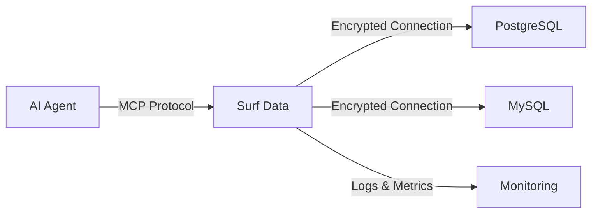
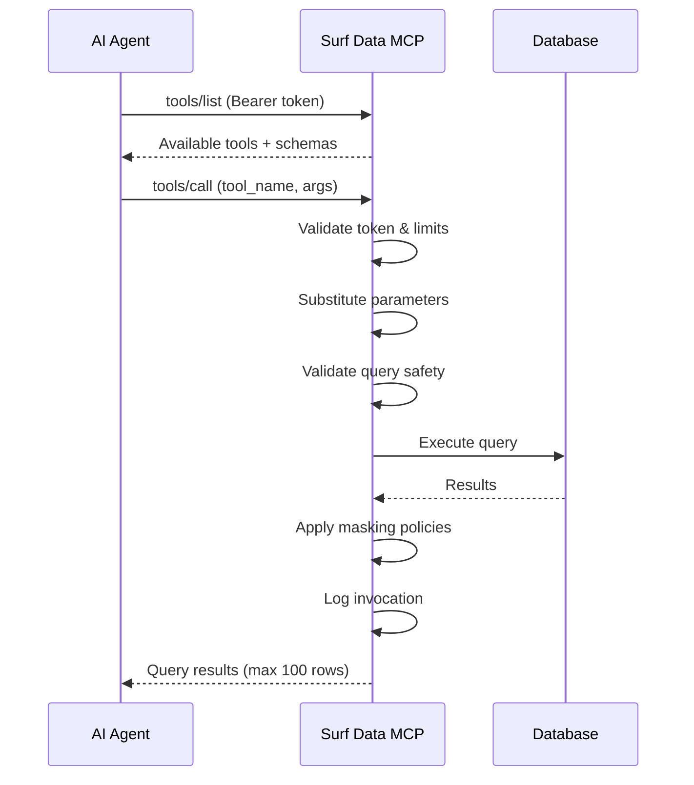

## Architecture overview

Surf Data acts as a secure bridge between your databases and AI agents. Here's how the pieces fit together:



## Key concepts

### Organizations

An **Organization** is the top-level entity that manages billing, team members, and projects. Every user belongs to at least one organization.

- Each organization has a **billing plan** (Starter, Team, Growth, or Enterprise)
- Execution limits and datasource limits are enforced at the organization level
- Team members can have **Admin** or **Member** roles

### Projects

A **Project** is a workspace that groups related datasources, views, and tools. Use projects to organize by use case or team.

**Examples:**
- "Customer Support Agent" — tools for looking up orders, customers, and tickets
- "Sales Dashboard" — tools for revenue metrics and pipeline data
- "Internal Analytics" — tools for team productivity and usage stats

Each project can be **published** independently, generating its own MCP endpoint and access tokens.

### Datasources

A **Datasource** is a database connection. Surf Data currently supports:

| Type | Description |
|------|-------------|
| **PostgreSQL** | Full support including SSL and connection strings |
| **MySQL** | Full support including connection strings |
| **Demo** | Pre-configured sample database for testing |

Connection credentials are **encrypted at rest** and decrypted only when executing queries.

<Note>
  We recommend using **read-only database users** for datasource connections. Surf Data blocks destructive SQL operations (INSERT, UPDATE, DELETE, DROP, etc.), but read-only users add an extra layer of protection.
</Note>

### Agent Views

An **Agent View** is a saved SQL query that defines a dataset. Views serve as the foundation for MCP tools — every tool must be linked to a view.

Views let you:
- Pre-define safe, tested queries
- Control exactly what data is exposed
- Reuse the same query across multiple tools

```sql
-- Example: Active customers view
SELECT id, name, email, plan, created_at
FROM customers
WHERE status = 'active' AND deleted_at IS NULL
```

### MCP Tools

An **MCP Tool** is a callable function exposed to AI agents via the Model Context Protocol. Tools are built on top of Agent Views and support **parameterized queries**.

Each tool defines:
- **Name** — the function name agents call (e.g., `get_customer_by_id`)
- **Description** — human-readable explanation of what it does
- **SQL Query** — a parameterized template using `{parameter_name}` syntax
- **Parameters** — input definitions with types and requirements
- **Security Policy** — optional PII masking rules

```sql
-- Example: Parameterized tool query
SELECT id, name, email, plan
FROM customers
WHERE id = {customer_id}
```

When an agent calls this tool with `customer_id = "123"`, Surf Data substitutes the parameter and executes the query securely.

### MCP Tokens

**MCP Tokens** are Bearer tokens that authenticate agent requests to your published project. Each token:

- Is generated as a secure hash (the plain token is shown **only once** at creation)
- Can be named for identification (e.g., "claude-production", "cursor-dev")
- Can be activated or deactivated without deletion
- Has an optional expiration date
- Is scoped to a single project

### Publishing

**Publishing** makes your project's tools available via an MCP endpoint. When you publish:

1. The project is marked as published
2. You select which tools to expose
3. A Bearer token is generated
4. An MCP endpoint URL is provided

Agents authenticate with the Bearer token and can discover and call your published tools.

## Model Context Protocol (MCP)

The **Model Context Protocol** is an open standard for connecting AI agents to external data sources and tools. Surf Data implements MCP using **JSON-RPC 2.0** over HTTP.

### Supported MCP methods

| Method | Description |
|--------|-------------|
| `initialize` | Returns server capabilities and protocol version |
| `tools/list` | Lists all available tools for the authenticated project |
| `tools/call` | Executes a tool with provided arguments |
| `ping` | Health check endpoint |

### Request flow



## Data flow and security

Every query execution goes through multiple safety layers:

1. **Token validation** — verify Bearer token is active and not expired
2. **Plan limit check** — ensure monthly execution quota is not exceeded
3. **Parameter substitution** — safely inject parameters with escaping
4. **Query safety validation** — block destructive SQL patterns (DROP, DELETE, UPDATE, etc.)
5. **Row limiting** — automatically add `LIMIT 100` to prevent unbounded queries
6. **Policy execution** — apply PII masking rules if configured
7. **Invocation logging** — record every execution for audit trail
8. **Usage tracking** — increment counters for billing and alerts
