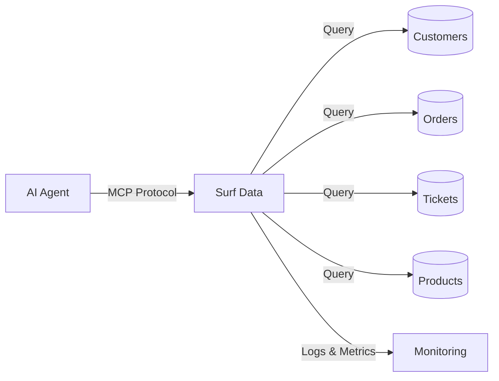

## Overview

A Customer Support Agent powered by Surf Data can access customer history, order details, previous interactions, and product information to provide comprehensive support without requiring direct database access.

This example shows how to configure Surf Data so that an AI agent can resolve support tickets autonomously with complete context.

## Architecture



## What you'll build

By the end of this guide, your AI agent will be able to:

- Look up customer profiles and subscription status
- View order history and shipping details
- Access previous support ticket history
- Search the product catalog for troubleshooting
- Provide contextualized responses based on real data

## Step 1: Set up the project

Create a new project in Surf Data called **Customer Support Agent** and connect your database as a datasource.

<Info>
  If you don't have a database ready, use the **Demo** datasource to follow along with sample data.
</Info>

## Step 2: Create Agent Views

Create the following Agent Views to define the data your agent can access:

### Customer Profile

```sql
SELECT
  c.id,
  c.name,
  c.email,
  c.phone,
  c.plan,
  c.status,
  c.created_at,
  c.last_login_at
FROM customers c
WHERE c.status = 'active'
```

### Order History

```sql
SELECT
  o.id AS order_id,
  o.customer_id,
  o.status,
  o.total_amount,
  o.currency,
  o.created_at AS order_date,
  o.shipping_status,
  o.tracking_code
FROM orders o
ORDER BY o.created_at DESC
```

### Support Tickets

```sql
SELECT
  t.id AS ticket_id,
  t.customer_id,
  t.subject,
  t.status,
  t.priority,
  t.category,
  t.created_at,
  t.resolved_at,
  t.agent_notes
FROM support_tickets t
ORDER BY t.created_at DESC
```

### Product Catalog

```sql
SELECT
  p.id AS product_id,
  p.name,
  p.sku,
  p.category,
  p.price,
  p.stock_quantity,
  p.description
FROM products p
WHERE p.active = true
```

## Step 3: Create MCP Tools

Create the following tools linked to your views:

### `get_customer`

Retrieves customer profile by email or ID.

- **Description**: "Look up a customer by their email address or customer ID. Returns profile details including name, plan, status, and last login."
- **SQL Query**:
  ```sql
  SELECT id, name, email, phone, plan, status, created_at, last_login_at
  FROM customers
  WHERE email = {email} OR id::text = {customer_id}
  LIMIT 1
  ```
- **Parameters**:
  - `email` (string, optional): Customer email address
  - `customer_id` (string, optional): Customer ID

### `get_order_history`

Retrieves recent orders for a customer.

- **Description**: "Get the order history for a specific customer. Returns the most recent orders with status, amounts, and shipping information."
- **SQL Query**:
  ```sql
  SELECT order_id, status, total_amount, currency, order_date, shipping_status, tracking_code
  FROM orders
  WHERE customer_id = {customer_id}
  ORDER BY order_date DESC
  LIMIT {limit}
  ```
- **Parameters**:
  - `customer_id` (string, required): Customer ID
  - `limit` (string, optional, default: "10"): Number of orders to return

### `get_ticket_history`

Retrieves previous support tickets for a customer.

- **Description**: "Get past support tickets for a customer to understand their history and avoid repetitive questions."
- **SQL Query**:
  ```sql
  SELECT ticket_id, subject, status, priority, category, created_at, resolved_at, agent_notes
  FROM support_tickets
  WHERE customer_id = {customer_id}
  ORDER BY created_at DESC
  LIMIT {limit}
  ```
- **Parameters**:
  - `customer_id` (string, required): Customer ID
  - `limit` (string, optional, default: "5"): Number of tickets to return

### `search_products`

Searches the product catalog.

- **Description**: "Search for products by name, SKU, or category. Useful for answering product questions or checking availability."
- **SQL Query**:
  ```sql
  SELECT product_id, name, sku, category, price, stock_quantity, description
  FROM products
  WHERE
    name ILIKE '%' || {search_term} || '%'
    OR sku = {search_term}
    OR category ILIKE '%' || {search_term} || '%'
  LIMIT 10
  ```
- **Parameters**:
  - `search_term` (string, required): Product name, SKU, or category to search for

## Step 4: Configure security

Before publishing, set up data masking to protect sensitive information:

1. Go to **Security > Data Masking** in your project settings
2. Add masking rules:
   - **Phone**: Mask with `***-***-1234` pattern
   - **Email**: Partial mask (`j***@example.com`)

<Warning>
  Always use a **read-only database user** for your datasource connection. Surf Data blocks destructive queries, but defense in depth is best practice.
</Warning>

## Step 5: Publish and connect

1. Click **Publish** and select all four tools
2. Generate an access token named `support-agent`
3. Connect your AI agent:

<Tabs>
  <Tab title="Claude Desktop">
    ```json
    {
      "mcpServers": {
        "support-agent": {
          "url": "https://surfdata.com.br/mcp/http",
          "headers": {
            "Authorization": "Bearer sk_live_<your-token>"
          }
        }
      }
    }
    ```
  </Tab>
  <Tab title="Cursor">
    ```json
    {
      "mcpServers": {
        "support-agent": {
          "url": "https://surfdata.com.br/mcp/http",
          "headers": {
            "Authorization": "Bearer sk_live_<your-token>"
          }
        }
      }
    }
    ```
  </Tab>
</Tabs>

## Example interactions

Once connected, your AI agent can handle conversations like:

<AccordionGroup>
  <Accordion title="Order status inquiry">
    **Customer**: "Where is my order #4521?"

    The agent will:
    1. Call `get_order_history` with the customer ID
    2. Find order #4521 and check shipping status
    3. Respond with tracking information and estimated delivery
  </Accordion>

  <Accordion title="Account troubleshooting">
    **Customer**: "I can't log in to my account. My email is maria@example.com"

    The agent will:
    1. Call `get_customer` with the email
    2. Check account status and last login date
    3. Identify if the account is locked, expired, or active
    4. Provide specific troubleshooting steps
  </Accordion>

  <Accordion title="Product availability check">
    **Customer**: "Do you have the wireless headphones in stock?"

    The agent will:
    1. Call `search_products` with "wireless headphones"
    2. Check stock quantities
    3. Suggest alternatives if the item is out of stock
  </Accordion>

  <Accordion title="Context-aware follow-up">
    **Customer**: "I'm having the same problem again with my subscription"

    The agent will:
    1. Call `get_customer` to identify the customer
    2. Call `get_ticket_history` to find previous related tickets
    3. Review past resolutions and apply context
    4. Avoid asking the customer to repeat information
  </Accordion>
</AccordionGroup>

## Best practices

<CardGroup cols={2}>
  <Card title="Use descriptive tool names" icon="tag">
    Clear tool descriptions help the AI agent choose the right tool for each situation.
  </Card>
  <Card title="Limit result sets" icon="filter">
    Use `LIMIT` in your queries and add limit parameters to avoid returning excessive data.
  </Card>
  <Card title="Mask sensitive data" icon="mask">
    Configure data masking for PII like phone numbers, emails, and addresses.
  </Card>
  <Card title="Monitor usage" icon="chart-line">
    Use the Monitoring dashboard to track which tools are called most and optimize accordingly.
  </Card>
</CardGroup>

## Next steps

<CardGroup cols={2}>
  <Card title="Data Masking" icon="shield-halved" href="/en/security/data-masking">
    Configure PII protection for your support agent.
  </Card>
  <Card title="Monitoring" icon="chart-line" href="/en/monitoring/evals">
    Review execution logs to evaluate agent performance.
  </Card>
</CardGroup>
