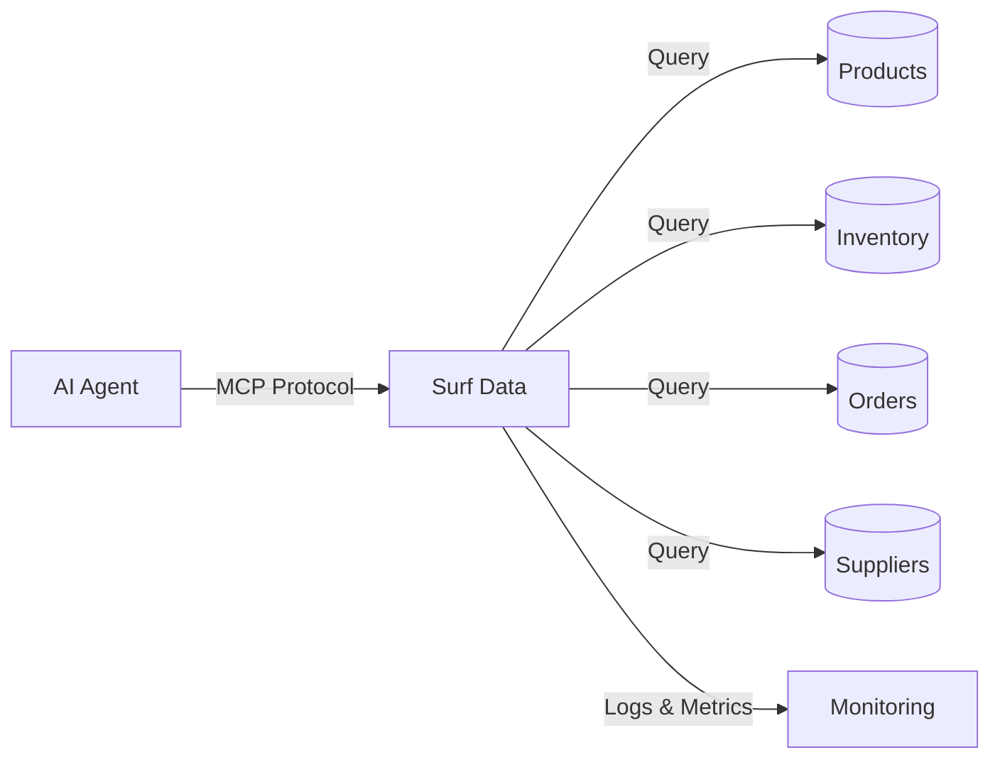

## Overview

An E-commerce Inventory Agent powered by Surf Data lets your operations team query stock levels, track order fulfillment, and monitor supplier performance through natural language — without needing direct database access or custom reports.

## Architecture



## What you'll build

By the end of this guide, your AI agent will be able to:

- Search the product catalog by name, SKU, or category
- Check real-time stock levels and identify low-stock items
- Track order fulfillment status and shipping
- Monitor supplier lead times and pending purchase orders

## Step 1: Set up the project

Create a new project in Surf Data called **E-commerce Inventory** and connect your e-commerce database as a datasource.

<Info>
  If you don't have a database ready, use the **Demo** datasource to follow along with sample data.
</Info>

## Step 2: Create Agent Views

### Product Catalog

```sql
SELECT
  p.id AS product_id,
  p.sku,
  p.name,
  p.category,
  p.price,
  p.cost,
  p.weight,
  p.active
FROM products p
WHERE p.active = true
```

### Stock Levels

```sql
SELECT
  p.sku,
  p.name,
  p.category,
  i.warehouse,
  i.quantity_available,
  i.quantity_reserved,
  i.reorder_point,
  CASE
    WHEN i.quantity_available <= 0 THEN 'out_of_stock'
    WHEN i.quantity_available <= i.reorder_point THEN 'low_stock'
    ELSE 'in_stock'
  END AS stock_status
FROM products p
JOIN inventory i ON p.id = i.product_id
WHERE p.active = true
```

### Order Fulfillment

```sql
SELECT
  o.id AS order_id,
  o.customer_email,
  o.status,
  o.created_at AS order_date,
  o.shipped_at,
  o.delivered_at,
  o.tracking_code,
  o.carrier,
  COUNT(oi.id) AS total_items,
  SUM(oi.quantity * oi.unit_price) AS order_total
FROM orders o
JOIN order_items oi ON o.id = oi.order_id
GROUP BY o.id, o.customer_email, o.status, o.created_at,
         o.shipped_at, o.delivered_at, o.tracking_code, o.carrier
```

### Supplier Orders

```sql
SELECT
  po.id AS po_id,
  s.name AS supplier_name,
  po.status,
  po.created_at AS order_date,
  po.expected_delivery,
  po.total_amount,
  COUNT(poi.id) AS total_items
FROM purchase_orders po
JOIN suppliers s ON po.supplier_id = s.id
JOIN purchase_order_items poi ON po.id = poi.purchase_order_id
GROUP BY po.id, s.name, po.status, po.created_at,
         po.expected_delivery, po.total_amount
```

## Step 3: Create MCP Tools

### `search_catalog`

- **Description**: "Search the product catalog by name, SKU, or category. Returns product details including price and availability status."
- **SQL Query**:
  ```sql
  SELECT product_id, sku, name, category, price
  FROM product_catalog
  WHERE name ILIKE '%' || {search} || '%'
     OR sku = {search}
     OR category ILIKE '%' || {search} || '%'
  LIMIT 15
  ```
- **Parameters**:
  - `search` (string, required): Product name, SKU, or category

### `check_stock`

- **Description**: "Check current stock levels. Can filter by product SKU, category, or stock status (out_of_stock, low_stock, in_stock)."
- **SQL Query**:
  ```sql
  SELECT sku, name, category, warehouse, quantity_available,
         quantity_reserved, reorder_point, stock_status
  FROM stock_levels
  WHERE ({sku} IS NULL OR sku = {sku})
    AND ({category} IS NULL OR category ILIKE '%' || {category} || '%')
    AND ({status} IS NULL OR stock_status = {status})
  ORDER BY quantity_available ASC
  LIMIT {limit}
  ```
- **Parameters**:
  - `sku` (string, optional): Filter by specific product SKU
  - `category` (string, optional): Filter by product category
  - `status` (string, optional): Filter by stock status (out_of_stock, low_stock, in_stock)
  - `limit` (string, optional, default: "20"): Number of results

### `get_order_status`

- **Description**: "Look up order fulfillment status by order ID or customer email. Returns shipping status, tracking code, and carrier information."
- **SQL Query**:
  ```sql
  SELECT order_id, customer_email, status, order_date, shipped_at,
         delivered_at, tracking_code, carrier, total_items, order_total
  FROM order_fulfillment
  WHERE ({order_id} IS NULL OR order_id::text = {order_id})
    AND ({email} IS NULL OR customer_email = {email})
  ORDER BY order_date DESC
  LIMIT {limit}
  ```
- **Parameters**:
  - `order_id` (string, optional): Order ID
  - `email` (string, optional): Customer email
  - `limit` (string, optional, default: "10"): Number of orders

### `get_supplier_orders`

- **Description**: "Check pending purchase orders and supplier deliveries. Useful for knowing when restocking will arrive."
- **SQL Query**:
  ```sql
  SELECT po_id, supplier_name, status, order_date, expected_delivery,
         total_amount, total_items
  FROM supplier_orders
  WHERE ({status} IS NULL OR status = {status})
    AND ({supplier} IS NULL OR supplier_name ILIKE '%' || {supplier} || '%')
  ORDER BY expected_delivery ASC
  LIMIT {limit}
  ```
- **Parameters**:
  - `status` (string, optional): Filter by PO status (pending, shipped, delivered)
  - `supplier` (string, optional): Filter by supplier name
  - `limit` (string, optional, default: "10"): Number of results

## Step 4: Configure security

Set up data masking to protect customer information:

1. Go to **Security > Data Masking**
2. Add masking rules:
   - **customer_email**: Partial mask (`j***@example.com`)

<Warning>
  Always use a **read-only database user** for your datasource connection.
</Warning>

## Step 5: Publish and connect

1. Click **Publish** and select all four tools
2. Generate an access token named `inventory-agent`
3. Connect your AI agent:

<Tabs>
  <Tab title="Claude Desktop">
    ```json
    {
      "mcpServers": {
        "inventory-agent": {
          "url": "https://surfdata.com.br/mcp/http",
          "headers": {
            "Authorization": "Bearer sk_live_<your-token>"
          }
        }
      }
    }
    ```
  </Tab>
  <Tab title="Cursor">
    ```json
    {
      "mcpServers": {
        "inventory-agent": {
          "url": "https://surfdata.com.br/mcp/http",
          "headers": {
            "Authorization": "Bearer sk_live_<your-token>"
          }
        }
      }
    }
    ```
  </Tab>
</Tabs>

## Example interactions

<AccordionGroup>
  <Accordion title="Low stock alert">
    **Ops Manager**: "Which products are running low on stock?"

    The agent will:
    1. Call `check_stock` with status "low_stock"
    2. List products below reorder point with quantities
    3. Suggest which items need immediate restocking
  </Accordion>

  <Accordion title="Order tracking">
    **Support Agent**: "Where is order #8842?"

    The agent will:
    1. Call `get_order_status` with order_id "8842"
    2. Return current status, carrier, and tracking code
    3. Provide estimated delivery based on shipping date
  </Accordion>

  <Accordion title="Restocking timeline">
    **Ops Manager**: "When is the next shipment from TechParts arriving?"

    The agent will:
    1. Call `get_supplier_orders` with supplier "TechParts" and status "shipped"
    2. Show expected delivery dates and items in the order
  </Accordion>

  <Accordion title="Product lookup">
    **Sales Rep**: "Do we have any wireless keyboards in stock?"

    The agent will:
    1. Call `search_catalog` with "wireless keyboard"
    2. Call `check_stock` for matched SKUs
    3. Return available options with prices and stock levels
  </Accordion>
</AccordionGroup>

## Next steps

<CardGroup cols={2}>
  <Card title="Alerts" icon="bell" href="/en/monitoring/alerts">
    Set up alerts for when stock levels drop below thresholds.
  </Card>
  <Card title="Data Masking" icon="shield-halved" href="/en/security/data-masking">
    Protect customer PII in order data.
  </Card>
</CardGroup>
