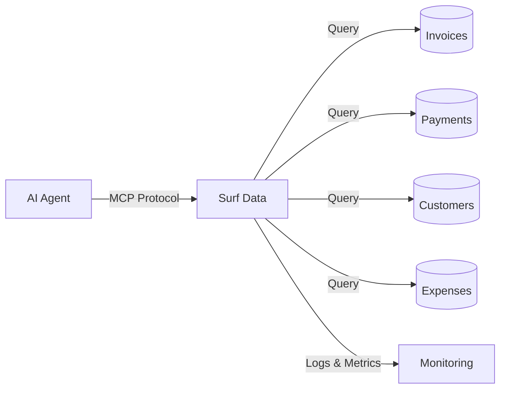

## Overview

A Financial Operations Agent powered by Surf Data lets your finance team query invoices, track payments, monitor accounts receivable, and generate financial summaries through natural language — replacing manual spreadsheet lookups and ad-hoc database queries.

## Architecture



## What you'll build

By the end of this guide, your AI agent will be able to:

- Look up invoices by customer, status, or date range
- Track payment status and identify overdue accounts
- Summarize revenue and expenses by period
- Monitor accounts receivable aging

## Step 1: Set up the project

Create a new project in Surf Data called **Financial Operations** and connect your accounting database as a datasource.

<Info>
  If you don't have a database ready, use the **Demo** datasource to follow along with sample data.
</Info>

## Step 2: Create Agent Views

### Invoices

```sql
SELECT
  i.id AS invoice_id,
  i.invoice_number,
  c.name AS customer_name,
  i.issue_date,
  i.due_date,
  i.total_amount,
  i.currency,
  i.status,
  i.paid_at
FROM invoices i
JOIN customers c ON i.customer_id = c.id
ORDER BY i.issue_date DESC
```

### Payments

```sql
SELECT
  p.id AS payment_id,
  p.invoice_id,
  i.invoice_number,
  c.name AS customer_name,
  p.amount,
  p.currency,
  p.payment_method,
  p.payment_date,
  p.status
FROM payments p
JOIN invoices i ON p.invoice_id = i.id
JOIN customers c ON i.customer_id = c.id
ORDER BY p.payment_date DESC
```

### Accounts Receivable Aging

```sql
SELECT
  c.name AS customer_name,
  COUNT(i.id) AS open_invoices,
  SUM(i.total_amount) AS total_outstanding,
  MIN(i.due_date) AS oldest_due_date,
  CASE
    WHEN MIN(i.due_date) < CURRENT_DATE - INTERVAL '90 days' THEN '90+'
    WHEN MIN(i.due_date) < CURRENT_DATE - INTERVAL '60 days' THEN '60-90'
    WHEN MIN(i.due_date) < CURRENT_DATE - INTERVAL '30 days' THEN '30-60'
    WHEN MIN(i.due_date) < CURRENT_DATE THEN '1-30'
    ELSE 'current'
  END AS aging_bucket
FROM invoices i
JOIN customers c ON i.customer_id = c.id
WHERE i.status IN ('sent', 'overdue')
GROUP BY c.name
ORDER BY total_outstanding DESC
```

### Monthly Summary

```sql
SELECT
  DATE_TRUNC('month', i.issue_date) AS month,
  COUNT(i.id) AS invoices_issued,
  SUM(i.total_amount) AS total_invoiced,
  SUM(CASE WHEN i.status = 'paid' THEN i.total_amount ELSE 0 END) AS total_collected,
  SUM(CASE WHEN i.status IN ('sent', 'overdue') THEN i.total_amount ELSE 0 END) AS total_outstanding,
  i.currency
FROM invoices i
GROUP BY month, i.currency
ORDER BY month DESC
```

## Step 3: Create MCP Tools

### `get_invoices`

- **Description**: "Look up invoices by customer name, status, or invoice number. Returns invoice details including amounts, dates, and payment status."
- **SQL Query**:
  ```sql
  SELECT invoice_id, invoice_number, customer_name, issue_date,
         due_date, total_amount, currency, status
  FROM invoices
  WHERE ({customer} IS NULL OR customer_name ILIKE '%' || {customer} || '%')
    AND ({status} IS NULL OR status = {status})
    AND ({invoice_number} IS NULL OR invoice_number = {invoice_number})
  ORDER BY issue_date DESC
  LIMIT {limit}
  ```
- **Parameters**:
  - `customer` (string, optional): Customer name
  - `status` (string, optional): Invoice status (draft, sent, paid, overdue, cancelled)
  - `invoice_number` (string, optional): Specific invoice number
  - `limit` (string, optional, default: "15"): Number of results

### `get_payments`

- **Description**: "Track payments received. Filter by customer, date, or payment method. Useful for reconciliation."
- **SQL Query**:
  ```sql
  SELECT payment_id, invoice_number, customer_name, amount, currency,
         payment_method, payment_date, status
  FROM payments
  WHERE ({customer} IS NULL OR customer_name ILIKE '%' || {customer} || '%')
    AND ({method} IS NULL OR payment_method = {method})
  ORDER BY payment_date DESC
  LIMIT {limit}
  ```
- **Parameters**:
  - `customer` (string, optional): Customer name
  - `method` (string, optional): Payment method (credit_card, bank_transfer, pix, boleto)
  - `limit` (string, optional, default: "15"): Number of results

### `get_ar_aging`

- **Description**: "View accounts receivable aging report. Shows outstanding amounts grouped by aging bucket (current, 1-30, 30-60, 60-90, 90+ days overdue)."
- **SQL Query**:
  ```sql
  SELECT customer_name, open_invoices, total_outstanding, oldest_due_date,
         aging_bucket
  FROM ar_aging
  WHERE ({bucket} IS NULL OR aging_bucket = {bucket})
  ORDER BY total_outstanding DESC
  LIMIT {limit}
  ```
- **Parameters**:
  - `bucket` (string, optional): Filter by aging bucket (current, 1-30, 30-60, 60-90, 90+)
  - `limit` (string, optional, default: "20"): Number of results

### `get_monthly_summary`

- **Description**: "Get monthly financial summary with invoiced totals, collected amounts, and outstanding balances."
- **SQL Query**:
  ```sql
  SELECT month, invoices_issued, total_invoiced, total_collected,
         total_outstanding, currency
  FROM monthly_summary
  WHERE ({period} IS NULL OR TO_CHAR(month, 'YYYY-MM') = {period})
  ORDER BY month DESC
  LIMIT {limit}
  ```
- **Parameters**:
  - `period` (string, optional): Month in YYYY-MM format
  - `limit` (string, optional, default: "12"): Number of months

## Step 4: Configure security

Financial data requires strict access controls:

1. Go to **Security > Data Masking**
2. Add masking rules:
   - **customer_name**: No masking (needed for lookups)
   - **total_amount**: Visible only to finance team tokens

<Warning>
  Always use a **read-only database user**. Create separate tokens for finance staff and management with different masking policies.
</Warning>

## Step 5: Publish and connect

1. Click **Publish** and select all four tools
2. Generate an access token named `finance-agent`
3. Connect your AI agent:

<Tabs>
  <Tab title="Claude Desktop">
    ```json
    {
      "mcpServers": {
        "finance-agent": {
          "url": "https://surfdata.com.br/mcp/http",
          "headers": {
            "Authorization": "Bearer sk_live_<your-token>"
          }
        }
      }
    }
    ```
  </Tab>
  <Tab title="Cursor">
    ```json
    {
      "mcpServers": {
        "finance-agent": {
          "url": "https://surfdata.com.br/mcp/http",
          "headers": {
            "Authorization": "Bearer sk_live_<your-token>"
          }
        }
      }
    }
    ```
  </Tab>
</Tabs>

## Example interactions

<AccordionGroup>
  <Accordion title="Invoice lookup">
    **Finance Analyst**: "Show me all overdue invoices"

    The agent will:
    1. Call `get_invoices` with status "overdue"
    2. List all overdue invoices with customer names, amounts, and due dates
    3. Summarize total overdue amount
  </Accordion>

  <Accordion title="AR aging review">
    **CFO**: "Which customers have balances over 90 days overdue?"

    The agent will:
    1. Call `get_ar_aging` with bucket "90+"
    2. List customers with severely overdue balances
    3. Show total outstanding amounts per customer
  </Accordion>

  <Accordion title="Monthly close">
    **Controller**: "What's our revenue summary for January?"

    The agent will:
    1. Call `get_monthly_summary` with period "2025-01"
    2. Return total invoiced, collected, and outstanding amounts
    3. Provide collection rate percentage
  </Accordion>

  <Accordion title="Payment reconciliation">
    **Finance Analyst**: "Show me all Pix payments received this month"

    The agent will:
    1. Call `get_payments` with method "pix"
    2. List recent Pix payments with invoice references
    3. Help match payments to invoices for reconciliation
  </Accordion>
</AccordionGroup>

## Next steps

<CardGroup cols={2}>
  <Card title="Data Masking" icon="shield-halved" href="/en/security/data-masking">
    Protect financial data with role-based masking.
  </Card>
  <Card title="Alerts" icon="bell" href="/en/monitoring/alerts">
    Set up alerts for high usage or unusual query patterns.
  </Card>
</CardGroup>
