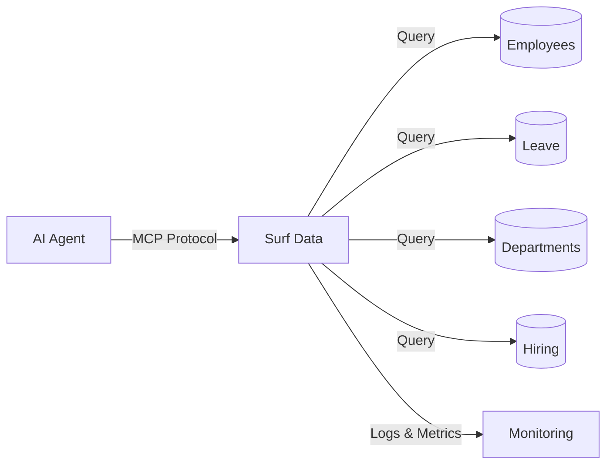

## Overview

An HR People Operations Agent powered by Surf Data enables your HR team and managers to instantly query employee data, check leave balances, review the hiring pipeline, and get team structure information — all through natural language, with sensitive data automatically masked.

## Architecture



## What you'll build

By the end of this guide, your AI agent will be able to:

- Look up employee profiles and team structure
- Check leave balances and upcoming time-off
- Review the hiring pipeline with candidate stages
- Get department headcount and org structure

## Step 1: Set up the project

Create a new project in Surf Data called **HR Operations** and connect your HR database as a datasource.

<Info>
  If you don't have a database ready, use the **Demo** datasource to follow along with sample data.
</Info>

## Step 2: Create Agent Views

### Employee Directory

```sql
SELECT
  e.id AS employee_id,
  e.full_name,
  e.email,
  e.job_title,
  e.department,
  e.manager_id,
  m.full_name AS manager_name,
  e.hire_date,
  e.status
FROM employees e
LEFT JOIN employees m ON e.manager_id = m.id
WHERE e.status = 'active'
```

### Leave Balances

```sql
SELECT
  e.id AS employee_id,
  e.full_name,
  e.department,
  lb.leave_type,
  lb.total_days,
  lb.used_days,
  lb.remaining_days,
  lb.year
FROM employees e
JOIN leave_balances lb ON e.id = lb.employee_id
WHERE e.status = 'active'
```

### Upcoming Time Off

```sql
SELECT
  e.full_name,
  e.department,
  lr.leave_type,
  lr.start_date,
  lr.end_date,
  lr.days_count,
  lr.status,
  lr.reason
FROM leave_requests lr
JOIN employees e ON lr.employee_id = e.id
WHERE lr.start_date >= CURRENT_DATE
  AND lr.status = 'approved'
ORDER BY lr.start_date ASC
```

### Hiring Pipeline

```sql
SELECT
  j.id AS job_id,
  j.title AS job_title,
  j.department,
  c.full_name AS candidate_name,
  c.stage,
  c.applied_at,
  c.source,
  c.recruiter
FROM job_openings j
JOIN candidates c ON j.id = c.job_id
WHERE j.status = 'open'
ORDER BY c.applied_at DESC
```

## Step 3: Create MCP Tools

### `find_employee`

- **Description**: "Look up an employee by name, email, or department. Returns profile, job title, manager, and hire date."
- **SQL Query**:
  ```sql
  SELECT employee_id, full_name, email, job_title, department,
         manager_name, hire_date
  FROM employee_directory
  WHERE full_name ILIKE '%' || {search} || '%'
     OR email ILIKE '%' || {search} || '%'
     OR department ILIKE '%' || {search} || '%'
  LIMIT 10
  ```
- **Parameters**:
  - `search` (string, required): Employee name, email, or department

### `get_leave_balance`

- **Description**: "Check leave balances for an employee or department. Shows total, used, and remaining days by leave type."
- **SQL Query**:
  ```sql
  SELECT full_name, department, leave_type, total_days, used_days,
         remaining_days
  FROM leave_balances
  WHERE ({employee_id} IS NULL OR employee_id::text = {employee_id})
    AND ({department} IS NULL OR department ILIKE '%' || {department} || '%')
    AND year = {year}
  ORDER BY full_name, leave_type
  ```
- **Parameters**:
  - `employee_id` (string, optional): Employee ID
  - `department` (string, optional): Department name
  - `year` (string, optional, default: "2025"): Year for balance lookup

### `get_upcoming_time_off`

- **Description**: "See who is scheduled to be out. Filter by department or date range to plan team availability."
- **SQL Query**:
  ```sql
  SELECT full_name, department, leave_type, start_date, end_date,
         days_count
  FROM upcoming_time_off
  WHERE ({department} IS NULL OR department ILIKE '%' || {department} || '%')
  ORDER BY start_date ASC
  LIMIT {limit}
  ```
- **Parameters**:
  - `department` (string, optional): Filter by department
  - `limit` (string, optional, default: "15"): Number of results

### `get_hiring_pipeline`

- **Description**: "View the current hiring pipeline. Filter by department or candidate stage to track recruiting progress."
- **SQL Query**:
  ```sql
  SELECT job_title, department, candidate_name, stage, applied_at,
         source, recruiter
  FROM hiring_pipeline
  WHERE ({department} IS NULL OR department ILIKE '%' || {department} || '%')
    AND ({stage} IS NULL OR stage = {stage})
  ORDER BY applied_at DESC
  LIMIT {limit}
  ```
- **Parameters**:
  - `department` (string, optional): Filter by department
  - `stage` (string, optional): Filter by stage (applied, screening, interview, offer, hired)
  - `limit` (string, optional, default: "20"): Number of results

## Step 4: Configure security

HR data is highly sensitive. Set up strict data masking:

1. Go to **Security > Data Masking**
2. Add masking rules:
   - **email**: Partial mask (`j***@company.com`)
   - **employee_id**: Full mask for non-HR users

<Warning>
  Always use a **read-only database user**. Consider creating separate tokens with different masking policies for HR staff vs. managers.
</Warning>

## Step 5: Publish and connect

1. Click **Publish** and select all four tools
2. Generate an access token named `hr-agent`
3. Connect your AI agent:

<Tabs>
  <Tab title="Claude Desktop">
    ```json
    {
      "mcpServers": {
        "hr-agent": {
          "url": "https://surfdata.com.br/mcp/http",
          "headers": {
            "Authorization": "Bearer sk_live_<your-token>"
          }
        }
      }
    }
    ```
  </Tab>
  <Tab title="Cursor">
    ```json
    {
      "mcpServers": {
        "hr-agent": {
          "url": "https://surfdata.com.br/mcp/http",
          "headers": {
            "Authorization": "Bearer sk_live_<your-token>"
          }
        }
      }
    }
    ```
  </Tab>
</Tabs>

## Example interactions

<AccordionGroup>
  <Accordion title="Team availability">
    **Manager**: "Who on the engineering team is out next week?"

    The agent will:
    1. Call `get_upcoming_time_off` with department "engineering"
    2. Filter results for next week's date range
    3. List team members who will be away with dates
  </Accordion>

  <Accordion title="Leave balance check">
    **Employee**: "How many vacation days do I have left?"

    The agent will:
    1. Call `get_leave_balance` with the employee's ID
    2. Return remaining days by leave type (vacation, sick, personal)
  </Accordion>

  <Accordion title="Hiring status">
    **Hiring Manager**: "How many candidates do we have in the interview stage for the backend role?"

    The agent will:
    1. Call `get_hiring_pipeline` with stage "interview"
    2. Filter for backend-related job openings
    3. Return candidate count and details
  </Accordion>

  <Accordion title="Org structure lookup">
    **New Employee**: "Who is the manager of the design team?"

    The agent will:
    1. Call `find_employee` with department "design"
    2. Identify the manager from the results
    3. Provide the manager's name and title
  </Accordion>
</AccordionGroup>

## Next steps

<CardGroup cols={2}>
  <Card title="Data Masking" icon="shield-halved" href="/en/security/data-masking">
    Set up strict PII masking for sensitive HR data.
  </Card>
  <Card title="Tokens" icon="key" href="/en/security/tokens">
    Create role-specific tokens with different access levels.
  </Card>
</CardGroup>
