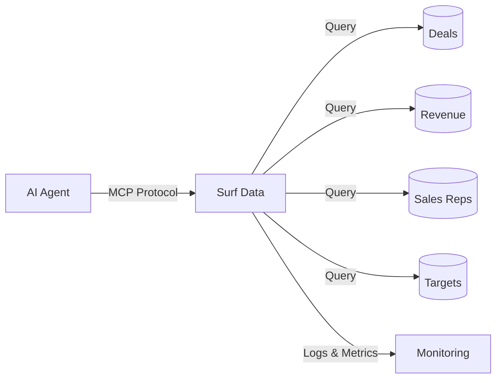

## Overview

A Sales Analytics Agent powered by Surf Data gives your team instant access to revenue metrics, pipeline health, and sales performance — all through natural language conversations. No more waiting for weekly reports or building custom dashboards.

## Architecture



## What you'll build

By the end of this guide, your AI agent will be able to:

- Report on revenue by period, product, or region
- Track the sales pipeline with deal stages and probabilities
- Compare individual and team performance against targets
- Identify trends and top-performing segments

## Step 1: Set up the project

Create a new project in Surf Data called **Sales Analytics** and connect your CRM or sales database as a datasource.

<Info>
  If you don't have a database ready, use the **Demo** datasource to follow along with sample data.
</Info>

## Step 2: Create Agent Views

### Revenue Overview

```sql
SELECT
  DATE_TRUNC('month', closed_at) AS month,
  SUM(amount) AS total_revenue,
  COUNT(*) AS deals_closed,
  AVG(amount) AS avg_deal_size,
  currency
FROM deals
WHERE status = 'won'
GROUP BY month, currency
ORDER BY month DESC
```

### Pipeline Snapshot

```sql
SELECT
  d.id AS deal_id,
  d.name AS deal_name,
  d.stage,
  d.amount,
  d.probability,
  d.expected_close_date,
  d.owner_id,
  r.name AS rep_name
FROM deals d
JOIN sales_reps r ON d.owner_id = r.id
WHERE d.status = 'open'
ORDER BY d.expected_close_date ASC
```

### Sales Rep Performance

```sql
SELECT
  r.id AS rep_id,
  r.name AS rep_name,
  r.team,
  COUNT(d.id) AS total_deals,
  SUM(CASE WHEN d.status = 'won' THEN 1 ELSE 0 END) AS deals_won,
  SUM(CASE WHEN d.status = 'won' THEN d.amount ELSE 0 END) AS revenue,
  ROUND(
    SUM(CASE WHEN d.status = 'won' THEN 1 ELSE 0 END)::decimal /
    NULLIF(COUNT(d.id), 0) * 100, 1
  ) AS win_rate
FROM sales_reps r
LEFT JOIN deals d ON d.owner_id = r.id
GROUP BY r.id, r.name, r.team
```

### Targets

```sql
SELECT
  t.rep_id,
  r.name AS rep_name,
  t.period,
  t.target_amount,
  t.actual_amount,
  ROUND((t.actual_amount::decimal / NULLIF(t.target_amount, 0)) * 100, 1) AS attainment_pct
FROM targets t
JOIN sales_reps r ON t.rep_id = r.id
ORDER BY t.period DESC
```

## Step 3: Create MCP Tools

### `get_revenue`

- **Description**: "Get revenue totals by month. Optionally filter by a specific period (e.g., '2025-01' for January 2025)."
- **SQL Query**:
  ```sql
  SELECT month, total_revenue, deals_closed, avg_deal_size, currency
  FROM revenue_overview
  WHERE ({period} IS NULL OR TO_CHAR(month, 'YYYY-MM') = {period})
  ORDER BY month DESC
  LIMIT {limit}
  ```
- **Parameters**:
  - `period` (string, optional): Month in YYYY-MM format
  - `limit` (string, optional, default: "12"): Number of months to return

### `get_pipeline`

- **Description**: "Get the current sales pipeline with all open deals, their stages, amounts, and expected close dates."
- **SQL Query**:
  ```sql
  SELECT deal_id, deal_name, stage, amount, probability, expected_close_date, rep_name
  FROM pipeline_snapshot
  WHERE ({stage} IS NULL OR stage = {stage})
  ORDER BY expected_close_date ASC
  LIMIT {limit}
  ```
- **Parameters**:
  - `stage` (string, optional): Filter by deal stage (e.g., "negotiation", "proposal")
  - `limit` (string, optional, default: "20"): Number of deals to return

### `get_rep_performance`

- **Description**: "Get sales performance metrics for a specific rep or the entire team. Includes deals won, revenue, and win rate."
- **SQL Query**:
  ```sql
  SELECT rep_name, team, total_deals, deals_won, revenue, win_rate
  FROM sales_rep_performance
  WHERE ({rep_name} IS NULL OR rep_name ILIKE '%' || {rep_name} || '%')
  ORDER BY revenue DESC
  ```
- **Parameters**:
  - `rep_name` (string, optional): Filter by sales rep name

### `get_target_attainment`

- **Description**: "Check quota attainment for sales reps. Shows target vs. actual revenue and attainment percentage."
- **SQL Query**:
  ```sql
  SELECT rep_name, period, target_amount, actual_amount, attainment_pct
  FROM targets
  WHERE ({rep_name} IS NULL OR rep_name ILIKE '%' || {rep_name} || '%')
    AND ({period} IS NULL OR period = {period})
  ORDER BY period DESC, attainment_pct DESC
  ```
- **Parameters**:
  - `rep_name` (string, optional): Filter by rep name
  - `period` (string, optional): Filter by period (e.g., "2025-Q1")

## Step 4: Publish and connect

1. Click **Publish** and select all four tools
2. Generate an access token named `sales-analytics`
3. Connect your AI agent:

<Tabs>
  <Tab title="Claude Desktop">
    ```json
    {
      "mcpServers": {
        "sales-analytics": {
          "url": "https://surfdata.com.br/mcp/http",
          "headers": {
            "Authorization": "Bearer sk_live_<your-token>"
          }
        }
      }
    }
    ```
  </Tab>
  <Tab title="Cursor">
    ```json
    {
      "mcpServers": {
        "sales-analytics": {
          "url": "https://surfdata.com.br/mcp/http",
          "headers": {
            "Authorization": "Bearer sk_live_<your-token>"
          }
        }
      }
    }
    ```
  </Tab>
</Tabs>

## Example interactions

<AccordionGroup>
  <Accordion title="Monthly revenue check">
    **Manager**: "What was our revenue last month?"

    The agent will:
    1. Call `get_revenue` with the current month period
    2. Return total revenue, number of deals closed, and average deal size
  </Accordion>

  <Accordion title="Pipeline review">
    **Manager**: "Show me all deals in the negotiation stage"

    The agent will:
    1. Call `get_pipeline` with stage "negotiation"
    2. List all open deals with amounts, probabilities, and expected close dates
    3. Summarize total pipeline value at that stage
  </Accordion>

  <Accordion title="Rep performance comparison">
    **VP Sales**: "How is the team performing this quarter? Who's our top closer?"

    The agent will:
    1. Call `get_rep_performance` for all reps
    2. Call `get_target_attainment` for the current quarter
    3. Rank reps by revenue and highlight the top performer
  </Accordion>

  <Accordion title="Deal forecasting">
    **Manager**: "What deals are expected to close this month?"

    The agent will:
    1. Call `get_pipeline` for all open deals
    2. Filter by expected close date within the current month
    3. Calculate weighted pipeline value using probabilities
  </Accordion>
</AccordionGroup>

## Next steps

<CardGroup cols={2}>
  <Card title="Monitoring" icon="chart-line" href="/en/monitoring/evals">
    Track which analytics queries are used most.
  </Card>
  <Card title="Tokens" icon="key" href="/en/security/tokens">
    Create separate tokens for different team members.
  </Card>
</CardGroup>
