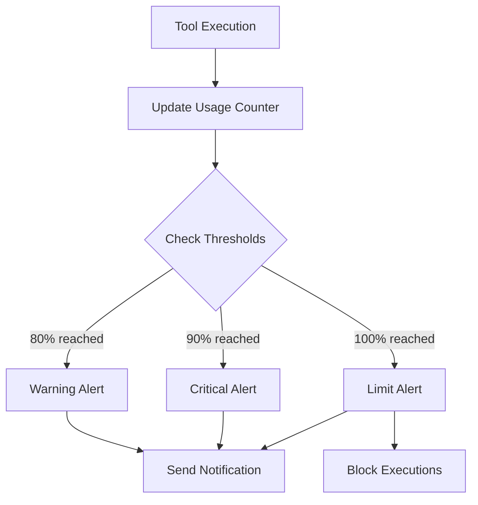

## Overview

Surf Data's alert system notifies you when your organization's usage approaches or exceeds defined thresholds. This helps you avoid unexpected service interruptions and plan capacity ahead of time.

## Alert types

### Execution alerts

| Alert Type | Threshold | Description |
|------------|-----------|-------------|
| **Warning** | 80% | You've used 80% of your monthly execution limit |
| **Critical** | 90% | You've used 90% — consider upgrading |
| **Limit reached** | 100% | Monthly limit reached — executions are blocked |

### Resource alerts

| Alert Type | Trigger | Description |
|------------|---------|-------------|
| **User limit** | Max members reached | Cannot invite new members |
| **Datasource limit** | Max datasources reached | Cannot add new datasources |

## How alerts work

Alerts are checked after each tool execution. Each alert type is sent **once per billing period** — you won't receive repeated notifications for the same threshold.

## Notification preferences

Configure which notifications you receive from **Settings** → **Profile**.

| Notification | Default | Description |
|-------------|---------|-------------|
| **Usage warning** | On | Alerts when approaching execution limits |
| **Limit reached** | On | Alert when execution limit is reached |
| **Weekly digest** | On | Weekly summary of usage and metrics |
| **System emails** | On | Important platform updates and maintenance |
| **Newsletter** | On | Product news and feature announcements |

<Tip>
  We recommend keeping **Usage warning** and **Limit reached** notifications enabled to avoid unexpected service interruptions.
</Tip>

## Notification delivery

Alerts are delivered via **email** using the address associated with your account. Email notifications include:

- The alert type and threshold
- Current usage numbers
- Your plan's limit
- A link to the Consumption Dashboard
- Upgrade options (if applicable)

## Responding to alerts

### When you receive a warning (80%)

- Review your usage in the [Consumption Dashboard](/en/monitoring/consumption)
- Identify if usage is expected or anomalous
- Consider upgrading if you're consistently approaching the limit

### When you receive a critical alert (90%)

- Take immediate action to manage remaining executions
- Evaluate which agents/tools are consuming the most
- Plan to upgrade before the limit is reached

### When the limit is reached (100%)

- Tool executions are **blocked** for the remainder of the billing cycle
- Agents will receive a `LIMIT_REACHED` error
- Options:
  1. **Upgrade your plan** to immediately increase the limit
  2. **Wait** for the next billing cycle to reset the counter
  3. **Optimize** your tool usage to reduce execution count

## Billing cycle reset

Execution counters reset at the beginning of each billing period:

- **Period start** — first day of billing cycle
- **Period end** — last day of billing cycle
- **Limit snapshot** — the plan's execution limit is recorded at period start

<Note>
  If you upgrade mid-cycle, the new limit takes effect immediately. Downgrading takes effect at the start of the next billing period.
</Note>
