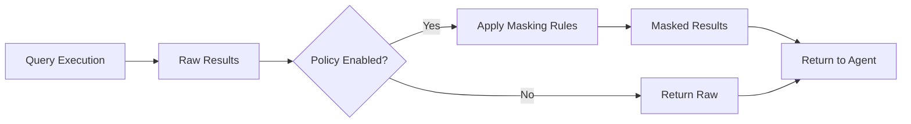

## Overview

Surf Data provides **built-in PII masking rules** that automatically transform sensitive data before it reaches AI agents. This ensures personally identifiable information (PII) is protected even when agents need to query production databases.

The system includes **19 predefined masking types** optimized for Brazilian data formats (CPF, CNPJ, RG) as well as universal types (email, phone, name, etc.), and can **auto-detect PII columns** by analyzing column names.

## How it works

Data masking is applied at the **tool level**. When enabled, masking rules are applied to query results before they are returned to the agent.



Masking rules are stored as a JSON array in the tool's `policyCode` field:

```json
[
  { "column": "email", "type": "email" },
  { "column": "cpf", "type": "cpf" },
  { "column": "nome_completo", "type": "name" },
  { "column": "telefone", "type": "phone" }
]
```

Each rule maps a **column name** to a **masking type**. When results are returned, the system applies the corresponding masking function to every value in that column.

## Enabling data masking

<Steps>
  <Step title="Open the tool editor">
    Navigate to your project and select the MCP Tool you want to protect.
  </Step>
  <Step title="Auto-detect PII (recommended)">
    Click the **Detect PII** button. The system runs your tool query with `LIMIT 1` and analyzes column names to suggest masking rules automatically. It recognizes both Portuguese and English column names (e.g., `email`, `telefone`, `cpf`, `nome_completo`, `endereco`).
  </Step>
  <Step title="Review and customize rules">
    Review the suggested rules. You can add, remove, or change the masking type for each column.
  </Step>
  <Step title="Enable policy">
    Toggle the **Policy Enabled** switch in the tool configuration.
  </Step>
  <Step title="Test">
    Run the tool with test values to verify the masking works as expected. The test results will show `masked: true` when masking is applied.
  </Step>
</Steps>

## Predefined masking types

| Type | Description | Example (before → after) |
|------|-------------|-------------------------|
| `cpf` | Brazilian CPF number | `123.456.789-00` → `***.***.*89-00` |
| `cnpj` | Brazilian CNPJ number | `12.345.678/0001-00` → `**.***.678/****-00` |
| `rg` | Brazilian RG number | `12.345.678-9` → `**.***.678-*` |
| `email` | Email address | `john@example.com` → `j***@e*****.com` |
| `phone` | Phone number | `(11) 98765-1234` → `(11) *****-1234` |
| `name` | Person name | `João Silva` → `J*** S****` |
| `address` | Physical address | `Rua das Flores, 123` → `[REDACTED]` |
| `ip` | IP address | `192.168.1.100` → `192.168.*.*` |
| `credit_card` | Credit card number | `4111-1111-1111-1111` → `****-****-****-1111` |
| `birth_date` | Date of birth | `1990-05-15` → `****-**-15` |
| `salary` | Salary/income | `R$ 5.000,00` → `[REDACTED]` |
| `health_data` | Health information | Any value → `[REDACTED]` |
| `biometric` | Biometric data | Any value → `[REDACTED]` |
| `genetic` | Genetic data | Any value → `[REDACTED]` |
| `political_opinion` | Political opinion | Any value → `[REDACTED]` |
| `religious_belief` | Religious belief | Any value → `[REDACTED]` |
| `sexual_orientation` | Sexual orientation | Any value → `[REDACTED]` |
| `ethnic_origin` | Ethnic origin | Any value → `[REDACTED]` |
| `generic` | Generic masking | Any value → `[MASKED]` |

## Auto-detection patterns

The auto-detect feature recognizes columns by name patterns in both Portuguese and English:

| PII Type | Detected column names |
|----------|----------------------|
| CPF | `cpf`, `nr_cpf`, `num_cpf`, `cpf_cliente` |
| CNPJ | `cnpj`, `nr_cnpj`, `num_cnpj` |
| RG | `rg`, `nr_rg`, `num_rg` |
| Email | `email`, `e_mail`, `email_address`, `endereco_email` |
| Phone | `telefone`, `celular`, `phone`, `mobile`, `fone` |
| Name | `nome`, `nome_completo`, `full_name`, `first_name`, `sobrenome` |
| Address | `endereco`, `address`, `logradouro`, `cep`, `zip_code` |
| IP | `ip`, `ip_address`, `endereco_ip` |
| Credit card | `cartao`, `credit_card`, `card_number`, `numero_cartao` |
| Birth date | `nascimento`, `data_nascimento`, `birth_date`, `date_of_birth` |
| Salary | `salario`, `salary`, `remuneracao`, `renda` |

## Best practices

<AccordionGroup>
  <Accordion title="Use auto-detect PII for new tools">
    Always start with auto-detection when creating a new tool. It recognizes common column name patterns and suggests appropriate masking types. You can then fine-tune the rules.
  </Accordion>

  <Accordion title="Mask at the tool level, not the view level">
    Apply masking on tools that agents can access, not on internal views used for dashboard queries. This keeps your internal analytics accurate while protecting agent-facing data.
  </Accordion>

  <Accordion title="Test masking thoroughly">
    Always test your masking rules with real-world data. The test endpoint returns a `masked: true` flag when masking is applied. Verify that:
    - All PII columns are properly masked
    - Non-PII columns remain readable
    - Null values are handled correctly
  </Accordion>

  <Accordion title="Use REDACTED types for LGPD sensitive categories">
    For LGPD sensitive data categories (health, biometric, genetic, political, religious, sexual orientation, ethnic origin), use the corresponding masking types that fully redact the values instead of partial masking.
  </Accordion>

  <Accordion title="Combine with column exclusion">
    For highly sensitive data (passwords, API keys, financial details), exclude the columns entirely from your Agent Views rather than relying on masking alone.
  </Accordion>
</AccordionGroup>

## Masking and LGPD compliance

Data masking is a key component of LGPD compliance. By masking PII before it reaches AI agents, you:

- **Minimize data exposure** — agents only see what they need
- **Meet consent requirements** — processed data doesn't identify individuals
- **Reduce breach impact** — even if an agent's context is leaked, PII is protected
- **Demonstrate compliance** — audit logs show masking was applied

The system's predefined types cover all LGPD sensitive data categories (Article 5, II), including health data, biometric and genetic data, political opinion, religious belief, sexual orientation, and ethnic origin.

See [LGPD Compliance](/en/security/lgpd) for more details on how Surf Data helps you meet regulatory requirements.
