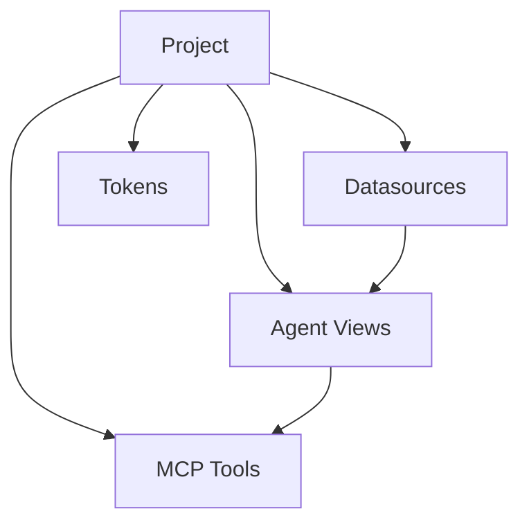

## Overview

A **Project** is the primary workspace in Surf Data. It groups datasources, Agent Views, and MCP Tools into a single deployable unit. Each project can be independently published to expose its tools via MCP.

## Creating a project

1. Navigate to the **Dashboard**
2. Click **New Project**
3. Enter a **name** and optional **description**
4. Click **Create**

<Tip>
  Use descriptive names that reflect the use case: "Customer Support Agent", "Sales Analytics Bot", "Internal HR Assistant".
</Tip>

## Project structure

Each project contains:

| Component | Description |
|-----------|-------------|
| **Datasources** | Database connections (PostgreSQL, MySQL, Demo) |
| **Agent Views** | Saved SQL queries that define available data |
| **MCP Tools** | Parameterized functions exposed to AI agents |
| **Tokens** | Bearer tokens for MCP authentication |

## Managing projects

### Viewing projects

The Dashboard shows all projects in your organization as cards. Each card displays:

- Project name and description
- Number of datasources, views, and tools
- Published status
- Creation date

### Editing a project

Click on a project card to open the project editor. The editor has three panels:

- **Left sidebar** — navigate between datasources, views, and tools
- **Center area** — edit queries, tool configuration, and parameters
- **Right sidebar** — test tools and view results

### Deleting a project

<Warning>
  Deleting a project permanently removes all its datasources, views, tools, and tokens. This action cannot be undone.
</Warning>

## Publishing

Projects must be **published** before agents can access their tools. See [Publishing](/platform/publishing) for details.

## Plan limits

The number of projects you can create is unlimited on all plans. However, other limits apply:

| Resource | Starter | Team | Growth | Enterprise |
|----------|---------|------|--------|------------|
| Datasources per project | 1 | 3 | 5 | Unlimited |
| Monthly executions (org-wide) | 5,000 | 10,000 | 25,000 | Unlimited |
| Team members | 3 | 5 | Unlimited | Unlimited |
