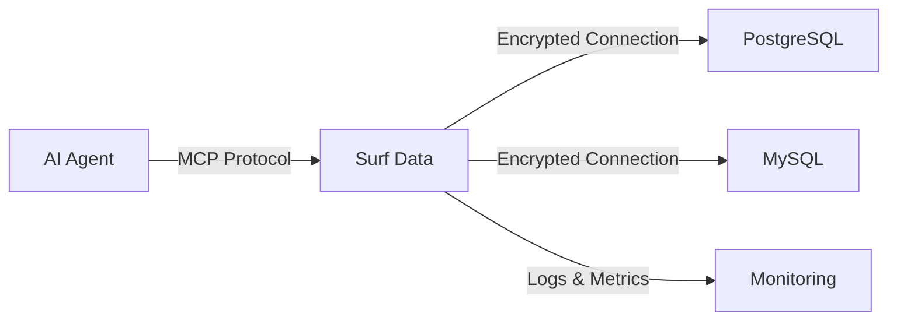
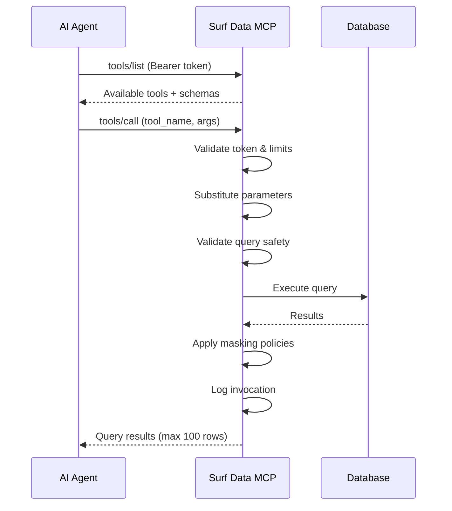

## Visão geral da arquitetura

O Surf Data atua como uma ponte segura entre seus bancos de dados e agentes de IA. Veja como as peças se encaixam:



## Conceitos-chave

### Organizações

Uma **Organização** é a entidade de nível superior que gerencia faturamento, membros da equipe e projetos. Todo usuário pertence a pelo menos uma organização.

- Cada organização possui um **plano de faturamento** (Starter, Team, Growth ou Enterprise)
- Limites de execução e de datasources são aplicados no nível da organização
- Membros da equipe podem ter os papéis de **Admin** ou **Member**

### Projetos

Um **Projeto** é um workspace que agrupa datasources, views e tools relacionados. Use projetos para organizar por caso de uso ou equipe.

**Exemplos:**
- "Agente de Suporte ao Cliente" — tools para consultar pedidos, clientes e tickets
- "Dashboard de Vendas" — tools para métricas de receita e dados do pipeline
- "Análise Interna" — tools para produtividade da equipe e estatísticas de uso

Cada projeto pode ser **publicado** independentemente, gerando seu próprio endpoint MCP e tokens de acesso.

### Datasources

Um **Datasource** é uma conexão com banco de dados. O Surf Data atualmente suporta:

| Tipo | Descrição |
|------|-----------|
| **PostgreSQL** | Suporte completo incluindo SSL e strings de conexão |
| **MySQL** | Suporte completo incluindo strings de conexão |
| **Demo** | Banco de dados de exemplo pré-configurado para testes |

As credenciais de conexão são **criptografadas em repouso** e descriptografadas apenas ao executar consultas.

<Note>
  Recomendamos o uso de **usuários de banco de dados somente leitura** para conexões de datasource. O Surf Data bloqueia operações SQL destrutivas (INSERT, UPDATE, DELETE, DROP, etc.), mas usuários somente leitura adicionam uma camada extra de proteção.
</Note>

### Agent Views

Uma **Agent View** é uma consulta SQL salva que define um conjunto de dados. As views servem como base para as MCP tools — toda tool deve estar vinculada a uma view.

As views permitem:
- Pré-definir consultas seguras e testadas
- Controlar exatamente quais dados são expostos
- Reutilizar a mesma consulta em múltiplas tools

```sql
-- Example: Active customers view
SELECT id, name, email, plan, created_at
FROM customers
WHERE status = 'active' AND deleted_at IS NULL
```

### MCP Tools

Uma **MCP Tool** é uma função chamável exposta a agentes de IA via Model Context Protocol. As tools são construídas sobre Agent Views e suportam **consultas parametrizadas**.

Cada tool define:
- **Name** — o nome da função que os agentes chamam (ex.: `get_customer_by_id`)
- **Description** — explicação legível do que ela faz
- **SQL Query** — um template parametrizado usando a sintaxe `{parameter_name}`
- **Parameters** — definições de entrada com tipos e requisitos
- **Security Policy** — regras opcionais de mascaramento de PII

```sql
-- Example: Parameterized tool query
SELECT id, name, email, plan
FROM customers
WHERE id = {customer_id}
```

Quando um agente chama essa tool com `customer_id = "123"`, o Surf Data substitui o parâmetro e executa a consulta de forma segura.

### MCP Tokens

**MCP Tokens** são Bearer tokens que autenticam as requisições dos agentes ao seu projeto publicado. Cada token:

- É gerado como um hash seguro (o token em texto puro é exibido **apenas uma vez** na criação)
- Pode ser nomeado para identificação (ex.: "claude-production", "cursor-dev")
- Pode ser ativado ou desativado sem exclusão
- Possui uma data de expiração opcional
- É vinculado a um único projeto

### Publicação

A **Publicação** torna as tools do seu projeto disponíveis via um endpoint MCP. Ao publicar:

1. O projeto é marcado como publicado
2. Você seleciona quais tools expor
3. Um Bearer token é gerado
4. Uma URL de endpoint MCP é fornecida

Os agentes se autenticam com o Bearer token e podem descobrir e chamar suas tools publicadas.

## Model Context Protocol (MCP)

O **Model Context Protocol** é um padrão aberto para conectar agentes de IA a fontes de dados externas e ferramentas. O Surf Data implementa o MCP usando **JSON-RPC 2.0** sobre HTTP.

### Métodos MCP suportados

| Método | Descrição |
|--------|-----------|
| `initialize` | Retorna as capacidades do servidor e a versão do protocolo |
| `tools/list` | Lista todas as tools disponíveis para o projeto autenticado |
| `tools/call` | Executa uma tool com os argumentos fornecidos |
| `ping` | Endpoint de verificação de saúde |

### Fluxo de requisição



## Fluxo de dados e segurança

Toda execução de consulta passa por múltiplas camadas de segurança:

1. **Validação do token** — verifica se o Bearer token está ativo e não expirado
2. **Verificação do limite do plano** — garante que a cota mensal de execuções não foi excedida
3. **Substituição de parâmetros** — injeta parâmetros de forma segura com escaping
4. **Validação de segurança da consulta** — bloqueia padrões SQL destrutivos (DROP, DELETE, UPDATE, etc.)
5. **Limitação de linhas** — adiciona automaticamente `LIMIT 100` para evitar consultas sem limite
6. **Execução de políticas** — aplica regras de mascaramento de PII se configuradas
7. **Log de invocações** — registra cada execução para trilha de auditoria
8. **Rastreamento de uso** — incrementa contadores para faturamento e alertas
