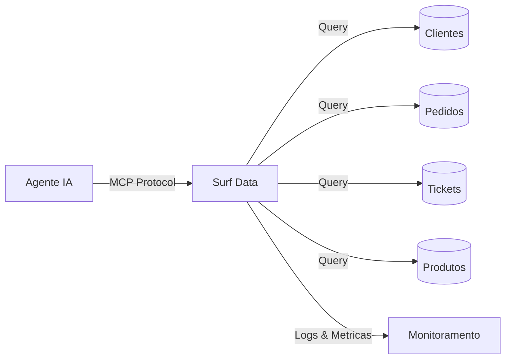

## Visao Geral

Um Agente de Suporte ao Cliente alimentado pelo Surf Data pode acessar historico de clientes, detalhes de pedidos, interacoes anteriores e informacoes de produtos para fornecer suporte completo sem necessidade de acesso direto ao banco de dados.

Este exemplo mostra como configurar o Surf Data para que um agente de IA possa resolver tickets de suporte de forma autonoma com contexto completo.

## Arquitetura



## O que voce vai construir

Ao final deste guia, seu agente de IA sera capaz de:

- Consultar perfis de clientes e status de assinatura
- Visualizar historico de pedidos e detalhes de envio
- Acessar historico de tickets de suporte anteriores
- Pesquisar o catalogo de produtos para solucao de problemas
- Fornecer respostas contextualizadas com base em dados reais

## Passo 1: Configurar o projeto

Crie um novo projeto no Surf Data chamado **Agente de Suporte ao Cliente** e conecte seu banco de dados como datasource.

<Info>
  Se voce nao tem um banco de dados pronto, use o datasource **Demo** para acompanhar com dados de exemplo.
</Info>

## Passo 2: Criar Agent Views

Crie as seguintes Agent Views para definir os dados que seu agente pode acessar:

### Perfil do Cliente

```sql
SELECT
  c.id,
  c.name,
  c.email,
  c.phone,
  c.plan,
  c.status,
  c.created_at,
  c.last_login_at
FROM customers c
WHERE c.status = 'active'
```

### Historico de Pedidos

```sql
SELECT
  o.id AS order_id,
  o.customer_id,
  o.status,
  o.total_amount,
  o.currency,
  o.created_at AS order_date,
  o.shipping_status,
  o.tracking_code
FROM orders o
ORDER BY o.created_at DESC
```

### Tickets de Suporte

```sql
SELECT
  t.id AS ticket_id,
  t.customer_id,
  t.subject,
  t.status,
  t.priority,
  t.category,
  t.created_at,
  t.resolved_at,
  t.agent_notes
FROM support_tickets t
ORDER BY t.created_at DESC
```

### Catalogo de Produtos

```sql
SELECT
  p.id AS product_id,
  p.name,
  p.sku,
  p.category,
  p.price,
  p.stock_quantity,
  p.description
FROM products p
WHERE p.active = true
```

## Passo 3: Criar MCP Tools

Crie as seguintes tools vinculadas as suas views:

### `get_customer`

Recupera o perfil do cliente por email ou ID.

- **Description**: "Busca um cliente pelo endereco de email ou ID. Retorna detalhes do perfil incluindo nome, plano, status e ultimo login."
- **SQL Query**:
  ```sql
  SELECT id, name, email, phone, plan, status, created_at, last_login_at
  FROM customers
  WHERE email = {email} OR id::text = {customer_id}
  LIMIT 1
  ```
- **Parameters**:
  - `email` (string, opcional): Endereco de email do cliente
  - `customer_id` (string, opcional): ID do cliente

### `get_order_history`

Recupera pedidos recentes de um cliente.

- **Description**: "Obtem o historico de pedidos de um cliente especifico. Retorna os pedidos mais recentes com status, valores e informacoes de envio."
- **SQL Query**:
  ```sql
  SELECT order_id, status, total_amount, currency, order_date, shipping_status, tracking_code
  FROM orders
  WHERE customer_id = {customer_id}
  ORDER BY order_date DESC
  LIMIT {limit}
  ```
- **Parameters**:
  - `customer_id` (string, obrigatorio): ID do cliente
  - `limit` (string, opcional, padrao: "10"): Numero de pedidos a retornar

### `get_ticket_history`

Recupera tickets de suporte anteriores de um cliente.

- **Description**: "Obtem tickets de suporte anteriores de um cliente para entender seu historico e evitar perguntas repetitivas."
- **SQL Query**:
  ```sql
  SELECT ticket_id, subject, status, priority, category, created_at, resolved_at, agent_notes
  FROM support_tickets
  WHERE customer_id = {customer_id}
  ORDER BY created_at DESC
  LIMIT {limit}
  ```
- **Parameters**:
  - `customer_id` (string, obrigatorio): ID do cliente
  - `limit` (string, opcional, padrao: "5"): Numero de tickets a retornar

### `search_products`

Pesquisa no catalogo de produtos.

- **Description**: "Pesquisa produtos por nome, SKU ou categoria. Util para responder perguntas sobre produtos ou verificar disponibilidade."
- **SQL Query**:
  ```sql
  SELECT product_id, name, sku, category, price, stock_quantity, description
  FROM products
  WHERE
    name ILIKE '%' || {search_term} || '%'
    OR sku = {search_term}
    OR category ILIKE '%' || {search_term} || '%'
  LIMIT 10
  ```
- **Parameters**:
  - `search_term` (string, obrigatorio): Nome do produto, SKU ou categoria para pesquisar

## Passo 4: Configurar seguranca

Antes de publicar, configure o mascaramento de dados para proteger informacoes sensiveis:

1. Va em **Security > Data Masking** nas configuracoes do projeto
2. Adicione regras de mascaramento:
   - **Telefone**: Mascarar com padrao `***-***-1234`
   - **Email**: Mascara parcial (`j***@example.com`)

<Warning>
  Sempre use um **usuario de banco de dados somente leitura** para a conexao do datasource. O Surf Data bloqueia queries destrutivas, mas defesa em profundidade e a melhor pratica.
</Warning>

## Passo 5: Publicar e conectar

1. Clique em **Publish** e selecione todas as quatro tools
2. Gere um token de acesso chamado `support-agent`
3. Conecte seu agente de IA:

<Tabs>
  <Tab title="Claude Desktop">
    ```json
    {
      "mcpServers": {
        "support-agent": {
          "url": "https://surfdata.com.br/mcp/http",
          "headers": {
            "Authorization": "Bearer sk_live_<your-token>"
          }
        }
      }
    }
    ```
  </Tab>
  <Tab title="Cursor">
    ```json
    {
      "mcpServers": {
        "support-agent": {
          "url": "https://surfdata.com.br/mcp/http",
          "headers": {
            "Authorization": "Bearer sk_live_<your-token>"
          }
        }
      }
    }
    ```
  </Tab>
</Tabs>

## Exemplos de interacoes

Uma vez conectado, seu agente de IA pode lidar com conversas como:

<AccordionGroup>
  <Accordion title="Consulta de status do pedido">
    **Cliente**: "Onde esta meu pedido #4521?"

    O agente ira:
    1. Chamar `get_order_history` com o ID do cliente
    2. Encontrar o pedido #4521 e verificar o status de envio
    3. Responder com informacoes de rastreamento e entrega estimada
  </Accordion>

  <Accordion title="Solucao de problemas da conta">
    **Cliente**: "Nao consigo fazer login na minha conta. Meu email e maria@example.com"

    O agente ira:
    1. Chamar `get_customer` com o email
    2. Verificar o status da conta e a data do ultimo login
    3. Identificar se a conta esta bloqueada, expirada ou ativa
    4. Fornecer passos especificos de solucao de problemas
  </Accordion>

  <Accordion title="Verificacao de disponibilidade de produto">
    **Cliente**: "Voces tem o fone de ouvido sem fio em estoque?"

    O agente ira:
    1. Chamar `search_products` com "fone de ouvido sem fio"
    2. Verificar quantidades em estoque
    3. Sugerir alternativas se o item estiver esgotado
  </Accordion>

  <Accordion title="Acompanhamento com contexto">
    **Cliente**: "Estou tendo o mesmo problema novamente com minha assinatura"

    O agente ira:
    1. Chamar `get_customer` para identificar o cliente
    2. Chamar `get_ticket_history` para encontrar tickets anteriores relacionados
    3. Revisar resolucoes anteriores e aplicar contexto
    4. Evitar pedir que o cliente repita informacoes
  </Accordion>
</AccordionGroup>

## Boas praticas

<CardGroup cols={2}>
  <Card title="Use nomes descritivos" icon="tag">
    Descricoes claras nas tools ajudam o agente de IA a escolher a ferramenta certa para cada situacao.
  </Card>
  <Card title="Limite conjuntos de resultados" icon="filter">
    Use `LIMIT` nas suas queries e adicione parametros de limite para evitar retornar dados excessivos.
  </Card>
  <Card title="Mascara dados sensiveis" icon="mask">
    Configure o mascaramento de dados para PII como telefones, emails e enderecos.
  </Card>
  <Card title="Monitore o uso" icon="chart-line">
    Use o dashboard de Monitoramento para acompanhar quais tools sao mais chamadas e otimizar de acordo.
  </Card>
</CardGroup>

## Proximos passos

<CardGroup cols={2}>
  <Card title="Mascaramento de Dados" icon="shield-halved" href="/pt-br/security/data-masking">
    Configure a protecao de PII para seu agente de suporte.
  </Card>
  <Card title="Monitoramento" icon="chart-line" href="/pt-br/monitoring/evals">
    Revise logs de execucao para avaliar o desempenho do agente.
  </Card>
</CardGroup>
