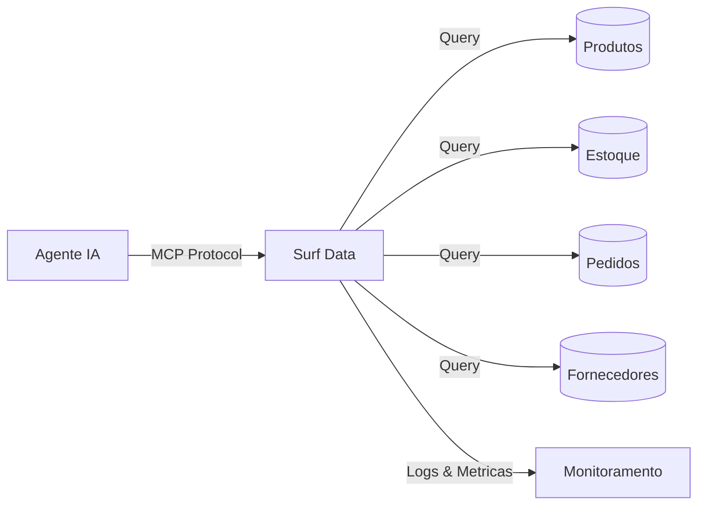

## Visao Geral

Um Agente de Inventario E-commerce alimentado pelo Surf Data permite que sua equipe de operacoes consulte niveis de estoque, acompanhe o fulfillment de pedidos e monitore o desempenho de fornecedores atraves de linguagem natural — sem precisar de acesso direto ao banco de dados ou relatorios customizados.

## Arquitetura



## O que voce vai construir

Ao final deste guia, seu agente de IA sera capaz de:

- Pesquisar o catalogo de produtos por nome, SKU ou categoria
- Verificar niveis de estoque em tempo real e identificar itens com estoque baixo
- Acompanhar status de fulfillment e envio de pedidos
- Monitorar prazos de entrega de fornecedores e pedidos de compra pendentes

## Passo 1: Configurar o projeto

Crie um novo projeto no Surf Data chamado **Inventario E-commerce** e conecte seu banco de dados de e-commerce como datasource.

<Info>
  Se voce nao tem um banco de dados pronto, use o datasource **Demo** para acompanhar com dados de exemplo.
</Info>

## Passo 2: Criar Agent Views

### Catalogo de Produtos

```sql
SELECT
  p.id AS product_id,
  p.sku,
  p.name,
  p.category,
  p.price,
  p.cost,
  p.weight,
  p.active
FROM products p
WHERE p.active = true
```

### Niveis de Estoque

```sql
SELECT
  p.sku,
  p.name,
  p.category,
  i.warehouse,
  i.quantity_available,
  i.quantity_reserved,
  i.reorder_point,
  CASE
    WHEN i.quantity_available <= 0 THEN 'out_of_stock'
    WHEN i.quantity_available <= i.reorder_point THEN 'low_stock'
    ELSE 'in_stock'
  END AS stock_status
FROM products p
JOIN inventory i ON p.id = i.product_id
WHERE p.active = true
```

### Fulfillment de Pedidos

```sql
SELECT
  o.id AS order_id,
  o.customer_email,
  o.status,
  o.created_at AS order_date,
  o.shipped_at,
  o.delivered_at,
  o.tracking_code,
  o.carrier,
  COUNT(oi.id) AS total_items,
  SUM(oi.quantity * oi.unit_price) AS order_total
FROM orders o
JOIN order_items oi ON o.id = oi.order_id
GROUP BY o.id, o.customer_email, o.status, o.created_at,
         o.shipped_at, o.delivered_at, o.tracking_code, o.carrier
```

### Pedidos de Fornecedores

```sql
SELECT
  po.id AS po_id,
  s.name AS supplier_name,
  po.status,
  po.created_at AS order_date,
  po.expected_delivery,
  po.total_amount,
  COUNT(poi.id) AS total_items
FROM purchase_orders po
JOIN suppliers s ON po.supplier_id = s.id
JOIN purchase_order_items poi ON po.id = poi.purchase_order_id
GROUP BY po.id, s.name, po.status, po.created_at,
         po.expected_delivery, po.total_amount
```

## Passo 3: Criar MCP Tools

### `search_catalog`

- **Description**: "Pesquisa o catalogo de produtos por nome, SKU ou categoria. Retorna detalhes do produto incluindo preco e status de disponibilidade."
- **SQL Query**:
  ```sql
  SELECT product_id, sku, name, category, price
  FROM product_catalog
  WHERE name ILIKE '%' || {search} || '%'
     OR sku = {search}
     OR category ILIKE '%' || {search} || '%'
  LIMIT 15
  ```
- **Parameters**:
  - `search` (string, obrigatorio): Nome do produto, SKU ou categoria

### `check_stock`

- **Description**: "Verifica niveis de estoque atuais. Pode filtrar por SKU do produto, categoria ou status de estoque (out_of_stock, low_stock, in_stock)."
- **SQL Query**:
  ```sql
  SELECT sku, name, category, warehouse, quantity_available,
         quantity_reserved, reorder_point, stock_status
  FROM stock_levels
  WHERE ({sku} IS NULL OR sku = {sku})
    AND ({category} IS NULL OR category ILIKE '%' || {category} || '%')
    AND ({status} IS NULL OR stock_status = {status})
  ORDER BY quantity_available ASC
  LIMIT {limit}
  ```
- **Parameters**:
  - `sku` (string, opcional): Filtrar por SKU especifico
  - `category` (string, opcional): Filtrar por categoria do produto
  - `status` (string, opcional): Filtrar por status de estoque (out_of_stock, low_stock, in_stock)
  - `limit` (string, opcional, padrao: "20"): Numero de resultados

### `get_order_status`

- **Description**: "Consulta status de fulfillment por ID do pedido ou email do cliente. Retorna status de envio, codigo de rastreamento e transportadora."
- **SQL Query**:
  ```sql
  SELECT order_id, customer_email, status, order_date, shipped_at,
         delivered_at, tracking_code, carrier, total_items, order_total
  FROM order_fulfillment
  WHERE ({order_id} IS NULL OR order_id::text = {order_id})
    AND ({email} IS NULL OR customer_email = {email})
  ORDER BY order_date DESC
  LIMIT {limit}
  ```
- **Parameters**:
  - `order_id` (string, opcional): ID do pedido
  - `email` (string, opcional): Email do cliente
  - `limit` (string, opcional, padrao: "10"): Numero de pedidos

### `get_supplier_orders`

- **Description**: "Verifica pedidos de compra pendentes e entregas de fornecedores. Util para saber quando a reposicao vai chegar."
- **SQL Query**:
  ```sql
  SELECT po_id, supplier_name, status, order_date, expected_delivery,
         total_amount, total_items
  FROM supplier_orders
  WHERE ({status} IS NULL OR status = {status})
    AND ({supplier} IS NULL OR supplier_name ILIKE '%' || {supplier} || '%')
  ORDER BY expected_delivery ASC
  LIMIT {limit}
  ```
- **Parameters**:
  - `status` (string, opcional): Filtrar por status do PO (pending, shipped, delivered)
  - `supplier` (string, opcional): Filtrar por nome do fornecedor
  - `limit` (string, opcional, padrao: "10"): Numero de resultados

## Passo 4: Configurar seguranca

Configure o mascaramento de dados para proteger informacoes de clientes:

1. Va em **Security > Data Masking**
2. Adicione regras de mascaramento:
   - **customer_email**: Mascara parcial (`j***@example.com`)

<Warning>
  Sempre use um **usuario de banco de dados somente leitura** para a conexao do datasource.
</Warning>

## Passo 5: Publicar e conectar

1. Clique em **Publish** e selecione todas as quatro tools
2. Gere um token de acesso chamado `inventory-agent`
3. Conecte seu agente de IA:

<Tabs>
  <Tab title="Claude Desktop">
    ```json
    {
      "mcpServers": {
        "inventory-agent": {
          "url": "https://surfdata.com.br/mcp/http",
          "headers": {
            "Authorization": "Bearer sk_live_<your-token>"
          }
        }
      }
    }
    ```
  </Tab>
  <Tab title="Cursor">
    ```json
    {
      "mcpServers": {
        "inventory-agent": {
          "url": "https://surfdata.com.br/mcp/http",
          "headers": {
            "Authorization": "Bearer sk_live_<your-token>"
          }
        }
      }
    }
    ```
  </Tab>
</Tabs>

## Exemplos de interacoes

<AccordionGroup>
  <Accordion title="Alerta de estoque baixo">
    **Gerente de Ops**: "Quais produtos estao com estoque baixo?"

    O agente ira:
    1. Chamar `check_stock` com status "low_stock"
    2. Listar produtos abaixo do ponto de reposicao com quantidades
    3. Sugerir quais itens precisam de reposicao imediata
  </Accordion>

  <Accordion title="Rastreamento de pedido">
    **Agente de Suporte**: "Onde esta o pedido #8842?"

    O agente ira:
    1. Chamar `get_order_status` com order_id "8842"
    2. Retornar status atual, transportadora e codigo de rastreamento
    3. Fornecer entrega estimada baseada na data de envio
  </Accordion>

  <Accordion title="Prazo de reposicao">
    **Gerente de Ops**: "Quando chega o proximo envio da TechParts?"

    O agente ira:
    1. Chamar `get_supplier_orders` com supplier "TechParts" e status "shipped"
    2. Mostrar datas previstas de entrega e itens no pedido
  </Accordion>

  <Accordion title="Consulta de produto">
    **Vendedor**: "Temos algum teclado sem fio em estoque?"

    O agente ira:
    1. Chamar `search_catalog` com "teclado sem fio"
    2. Chamar `check_stock` para os SKUs encontrados
    3. Retornar opcoes disponiveis com precos e niveis de estoque
  </Accordion>
</AccordionGroup>

## Proximos passos

<CardGroup cols={2}>
  <Card title="Alertas" icon="bell" href="/pt-br/monitoring/alerts">
    Configure alertas para quando niveis de estoque cairem abaixo dos limites.
  </Card>
  <Card title="Mascaramento de Dados" icon="shield-halved" href="/pt-br/security/data-masking">
    Proteja PII de clientes nos dados de pedidos.
  </Card>
</CardGroup>
