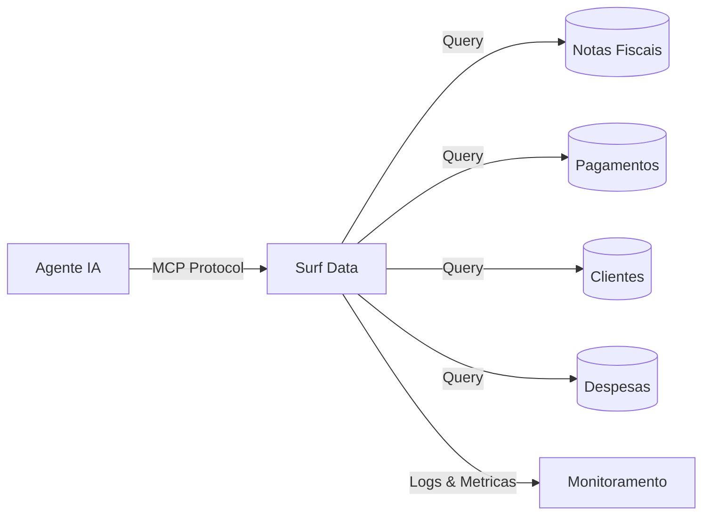

## Visao Geral

Um Agente de Operacoes Financeiras alimentado pelo Surf Data permite que sua equipe financeira consulte notas fiscais, acompanhe pagamentos, monitore contas a receber e gere resumos financeiros em linguagem natural — substituindo consultas manuais em planilhas e queries ad-hoc no banco de dados.

## Arquitetura



## O que voce vai construir

Ao final deste guia, seu agente de IA sera capaz de:

- Consultar notas fiscais por cliente, status ou periodo
- Acompanhar status de pagamentos e identificar contas em atraso
- Resumir receita e despesas por periodo
- Monitorar aging de contas a receber

## Passo 1: Configurar o projeto

Crie um novo projeto no Surf Data chamado **Operacoes Financeiras** e conecte seu banco de dados contabil como datasource.

<Info>
  Se voce nao tem um banco de dados pronto, use o datasource **Demo** para acompanhar com dados de exemplo.
</Info>

## Passo 2: Criar Agent Views

### Notas Fiscais

```sql
SELECT
  i.id AS invoice_id,
  i.invoice_number,
  c.name AS customer_name,
  i.issue_date,
  i.due_date,
  i.total_amount,
  i.currency,
  i.status,
  i.paid_at
FROM invoices i
JOIN customers c ON i.customer_id = c.id
ORDER BY i.issue_date DESC
```

### Pagamentos

```sql
SELECT
  p.id AS payment_id,
  p.invoice_id,
  i.invoice_number,
  c.name AS customer_name,
  p.amount,
  p.currency,
  p.payment_method,
  p.payment_date,
  p.status
FROM payments p
JOIN invoices i ON p.invoice_id = i.id
JOIN customers c ON i.customer_id = c.id
ORDER BY p.payment_date DESC
```

### Aging de Contas a Receber

```sql
SELECT
  c.name AS customer_name,
  COUNT(i.id) AS open_invoices,
  SUM(i.total_amount) AS total_outstanding,
  MIN(i.due_date) AS oldest_due_date,
  CASE
    WHEN MIN(i.due_date) < CURRENT_DATE - INTERVAL '90 days' THEN '90+'
    WHEN MIN(i.due_date) < CURRENT_DATE - INTERVAL '60 days' THEN '60-90'
    WHEN MIN(i.due_date) < CURRENT_DATE - INTERVAL '30 days' THEN '30-60'
    WHEN MIN(i.due_date) < CURRENT_DATE THEN '1-30'
    ELSE 'current'
  END AS aging_bucket
FROM invoices i
JOIN customers c ON i.customer_id = c.id
WHERE i.status IN ('sent', 'overdue')
GROUP BY c.name
ORDER BY total_outstanding DESC
```

### Resumo Mensal

```sql
SELECT
  DATE_TRUNC('month', i.issue_date) AS month,
  COUNT(i.id) AS invoices_issued,
  SUM(i.total_amount) AS total_invoiced,
  SUM(CASE WHEN i.status = 'paid' THEN i.total_amount ELSE 0 END) AS total_collected,
  SUM(CASE WHEN i.status IN ('sent', 'overdue') THEN i.total_amount ELSE 0 END) AS total_outstanding,
  i.currency
FROM invoices i
GROUP BY month, i.currency
ORDER BY month DESC
```

## Passo 3: Criar MCP Tools

### `get_invoices`

- **Description**: "Consulta notas fiscais por nome do cliente, status ou numero da nota. Retorna detalhes incluindo valores, datas e status de pagamento."
- **SQL Query**:
  ```sql
  SELECT invoice_id, invoice_number, customer_name, issue_date,
         due_date, total_amount, currency, status
  FROM invoices
  WHERE ({customer} IS NULL OR customer_name ILIKE '%' || {customer} || '%')
    AND ({status} IS NULL OR status = {status})
    AND ({invoice_number} IS NULL OR invoice_number = {invoice_number})
  ORDER BY issue_date DESC
  LIMIT {limit}
  ```
- **Parameters**:
  - `customer` (string, opcional): Nome do cliente
  - `status` (string, opcional): Status da nota (draft, sent, paid, overdue, cancelled)
  - `invoice_number` (string, opcional): Numero especifico da nota
  - `limit` (string, opcional, padrao: "15"): Numero de resultados

### `get_payments`

- **Description**: "Acompanha pagamentos recebidos. Filtre por cliente, data ou metodo de pagamento. Util para conciliacao."
- **SQL Query**:
  ```sql
  SELECT payment_id, invoice_number, customer_name, amount, currency,
         payment_method, payment_date, status
  FROM payments
  WHERE ({customer} IS NULL OR customer_name ILIKE '%' || {customer} || '%')
    AND ({method} IS NULL OR payment_method = {method})
  ORDER BY payment_date DESC
  LIMIT {limit}
  ```
- **Parameters**:
  - `customer` (string, opcional): Nome do cliente
  - `method` (string, opcional): Metodo de pagamento (credit_card, bank_transfer, pix, boleto)
  - `limit` (string, opcional, padrao: "15"): Numero de resultados

### `get_ar_aging`

- **Description**: "Visualiza relatorio de aging de contas a receber. Mostra valores em aberto agrupados por faixa de atraso (atual, 1-30, 30-60, 60-90, 90+ dias)."
- **SQL Query**:
  ```sql
  SELECT customer_name, open_invoices, total_outstanding, oldest_due_date,
         aging_bucket
  FROM ar_aging
  WHERE ({bucket} IS NULL OR aging_bucket = {bucket})
  ORDER BY total_outstanding DESC
  LIMIT {limit}
  ```
- **Parameters**:
  - `bucket` (string, opcional): Filtrar por faixa de aging (current, 1-30, 30-60, 60-90, 90+)
  - `limit` (string, opcional, padrao: "20"): Numero de resultados

### `get_monthly_summary`

- **Description**: "Obtem resumo financeiro mensal com totais faturados, valores recebidos e saldos em aberto."
- **SQL Query**:
  ```sql
  SELECT month, invoices_issued, total_invoiced, total_collected,
         total_outstanding, currency
  FROM monthly_summary
  WHERE ({period} IS NULL OR TO_CHAR(month, 'YYYY-MM') = {period})
  ORDER BY month DESC
  LIMIT {limit}
  ```
- **Parameters**:
  - `period` (string, opcional): Mes no formato YYYY-MM
  - `limit` (string, opcional, padrao: "12"): Numero de meses

## Passo 4: Configurar seguranca

Dados financeiros exigem controles de acesso rigorosos:

1. Va em **Security > Data Masking**
2. Adicione regras de mascaramento:
   - **customer_name**: Sem mascaramento (necessario para consultas)
   - **total_amount**: Visivel apenas para tokens da equipe financeira

<Warning>
  Sempre use um **usuario de banco de dados somente leitura**. Crie tokens separados para a equipe financeira e diretoria com diferentes politicas de mascaramento.
</Warning>

## Passo 5: Publicar e conectar

1. Clique em **Publish** e selecione todas as quatro tools
2. Gere um token de acesso chamado `finance-agent`
3. Conecte seu agente de IA:

<Tabs>
  <Tab title="Claude Desktop">
    ```json
    {
      "mcpServers": {
        "finance-agent": {
          "url": "https://surfdata.com.br/mcp/http",
          "headers": {
            "Authorization": "Bearer sk_live_<your-token>"
          }
        }
      }
    }
    ```
  </Tab>
  <Tab title="Cursor">
    ```json
    {
      "mcpServers": {
        "finance-agent": {
          "url": "https://surfdata.com.br/mcp/http",
          "headers": {
            "Authorization": "Bearer sk_live_<your-token>"
          }
        }
      }
    }
    ```
  </Tab>
</Tabs>

## Exemplos de interacoes

<AccordionGroup>
  <Accordion title="Consulta de notas fiscais">
    **Analista Financeiro**: "Mostre todas as notas fiscais em atraso"

    O agente ira:
    1. Chamar `get_invoices` com status "overdue"
    2. Listar todas as notas em atraso com nomes de clientes, valores e datas de vencimento
    3. Resumir valor total em atraso
  </Accordion>

  <Accordion title="Revisao de aging">
    **CFO**: "Quais clientes tem saldos com mais de 90 dias de atraso?"

    O agente ira:
    1. Chamar `get_ar_aging` com bucket "90+"
    2. Listar clientes com saldos severamente atrasados
    3. Mostrar valores totais em aberto por cliente
  </Accordion>

  <Accordion title="Fechamento mensal">
    **Controller**: "Qual e o resumo de receita de janeiro?"

    O agente ira:
    1. Chamar `get_monthly_summary` com periodo "2025-01"
    2. Retornar totais faturados, recebidos e em aberto
    3. Fornecer percentual de taxa de recebimento
  </Accordion>

  <Accordion title="Conciliacao de pagamentos">
    **Analista Financeiro**: "Mostre todos os pagamentos via Pix recebidos este mes"

    O agente ira:
    1. Chamar `get_payments` com method "pix"
    2. Listar pagamentos recentes via Pix com referencias de notas fiscais
    3. Ajudar a conciliar pagamentos com notas
  </Accordion>
</AccordionGroup>

## Proximos passos

<CardGroup cols={2}>
  <Card title="Mascaramento de Dados" icon="shield-halved" href="/pt-br/security/data-masking">
    Proteja dados financeiros com mascaramento por funcao.
  </Card>
  <Card title="Alertas" icon="bell" href="/pt-br/monitoring/alerts">
    Configure alertas para uso elevado ou padroes de consulta incomuns.
  </Card>
</CardGroup>
