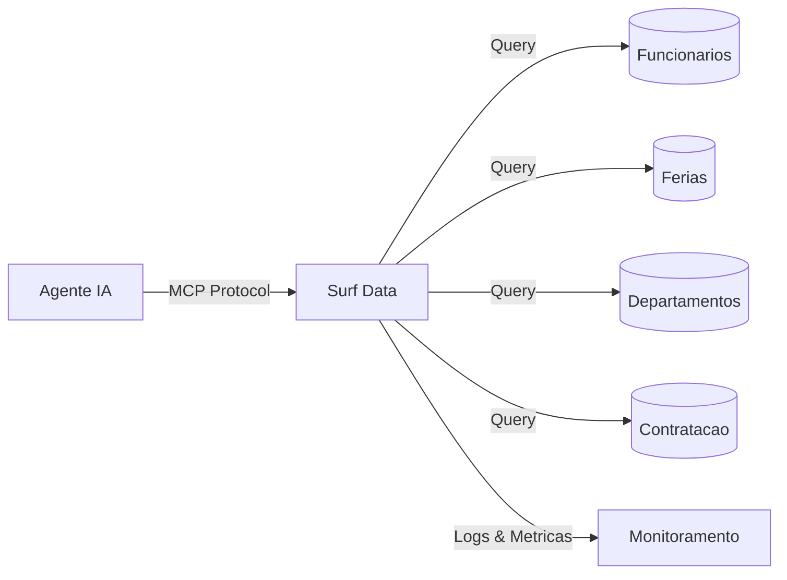

## Visao Geral

Um Agente de RH e People Ops alimentado pelo Surf Data permite que sua equipe de RH e gestores consultem dados de funcionarios, verifiquem saldo de ferias, acompanhem o pipeline de contratacao e obtenham informacoes sobre a estrutura da equipe — tudo em linguagem natural, com dados sensiveis mascarados automaticamente.

## Arquitetura



## O que voce vai construir

Ao final deste guia, seu agente de IA sera capaz de:

- Consultar perfis de funcionarios e estrutura de equipes
- Verificar saldo de ferias e ausencias programadas
- Acompanhar o pipeline de contratacao com estagios dos candidatos
- Obter headcount por departamento e estrutura organizacional

## Passo 1: Configurar o projeto

Crie um novo projeto no Surf Data chamado **RH Operations** e conecte seu banco de dados de RH como datasource.

<Info>
  Se voce nao tem um banco de dados pronto, use o datasource **Demo** para acompanhar com dados de exemplo.
</Info>

## Passo 2: Criar Agent Views

### Diretorio de Funcionarios

```sql
SELECT
  e.id AS employee_id,
  e.full_name,
  e.email,
  e.job_title,
  e.department,
  e.manager_id,
  m.full_name AS manager_name,
  e.hire_date,
  e.status
FROM employees e
LEFT JOIN employees m ON e.manager_id = m.id
WHERE e.status = 'active'
```

### Saldo de Ferias

```sql
SELECT
  e.id AS employee_id,
  e.full_name,
  e.department,
  lb.leave_type,
  lb.total_days,
  lb.used_days,
  lb.remaining_days,
  lb.year
FROM employees e
JOIN leave_balances lb ON e.id = lb.employee_id
WHERE e.status = 'active'
```

### Ausencias Programadas

```sql
SELECT
  e.full_name,
  e.department,
  lr.leave_type,
  lr.start_date,
  lr.end_date,
  lr.days_count,
  lr.status,
  lr.reason
FROM leave_requests lr
JOIN employees e ON lr.employee_id = e.id
WHERE lr.start_date >= CURRENT_DATE
  AND lr.status = 'approved'
ORDER BY lr.start_date ASC
```

### Pipeline de Contratacao

```sql
SELECT
  j.id AS job_id,
  j.title AS job_title,
  j.department,
  c.full_name AS candidate_name,
  c.stage,
  c.applied_at,
  c.source,
  c.recruiter
FROM job_openings j
JOIN candidates c ON j.id = c.job_id
WHERE j.status = 'open'
ORDER BY c.applied_at DESC
```

## Passo 3: Criar MCP Tools

### `find_employee`

- **Description**: "Busca um funcionario por nome, email ou departamento. Retorna perfil, cargo, gestor e data de admissao."
- **SQL Query**:
  ```sql
  SELECT employee_id, full_name, email, job_title, department,
         manager_name, hire_date
  FROM employee_directory
  WHERE full_name ILIKE '%' || {search} || '%'
     OR email ILIKE '%' || {search} || '%'
     OR department ILIKE '%' || {search} || '%'
  LIMIT 10
  ```
- **Parameters**:
  - `search` (string, obrigatorio): Nome do funcionario, email ou departamento

### `get_leave_balance`

- **Description**: "Verifica saldo de ferias de um funcionario ou departamento. Mostra total, usado e dias restantes por tipo."
- **SQL Query**:
  ```sql
  SELECT full_name, department, leave_type, total_days, used_days,
         remaining_days
  FROM leave_balances
  WHERE ({employee_id} IS NULL OR employee_id::text = {employee_id})
    AND ({department} IS NULL OR department ILIKE '%' || {department} || '%')
    AND year = {year}
  ORDER BY full_name, leave_type
  ```
- **Parameters**:
  - `employee_id` (string, opcional): ID do funcionario
  - `department` (string, opcional): Nome do departamento
  - `year` (string, opcional, padrao: "2025"): Ano da consulta

### `get_upcoming_time_off`

- **Description**: "Veja quem esta programado para se ausentar. Filtre por departamento para planejar disponibilidade da equipe."
- **SQL Query**:
  ```sql
  SELECT full_name, department, leave_type, start_date, end_date,
         days_count
  FROM upcoming_time_off
  WHERE ({department} IS NULL OR department ILIKE '%' || {department} || '%')
  ORDER BY start_date ASC
  LIMIT {limit}
  ```
- **Parameters**:
  - `department` (string, opcional): Filtrar por departamento
  - `limit` (string, opcional, padrao: "15"): Numero de resultados

### `get_hiring_pipeline`

- **Description**: "Visualize o pipeline de contratacao atual. Filtre por departamento ou estagio do candidato para acompanhar o progresso."
- **SQL Query**:
  ```sql
  SELECT job_title, department, candidate_name, stage, applied_at,
         source, recruiter
  FROM hiring_pipeline
  WHERE ({department} IS NULL OR department ILIKE '%' || {department} || '%')
    AND ({stage} IS NULL OR stage = {stage})
  ORDER BY applied_at DESC
  LIMIT {limit}
  ```
- **Parameters**:
  - `department` (string, opcional): Filtrar por departamento
  - `stage` (string, opcional): Filtrar por estagio (applied, screening, interview, offer, hired)
  - `limit` (string, opcional, padrao: "20"): Numero de resultados

## Passo 4: Configurar seguranca

Dados de RH sao altamente sensiveis. Configure mascaramento rigoroso:

1. Va em **Security > Data Masking**
2. Adicione regras de mascaramento:
   - **email**: Mascara parcial (`j***@empresa.com`)
   - **employee_id**: Mascara completa para usuarios nao-RH

<Warning>
  Sempre use um **usuario de banco de dados somente leitura**. Considere criar tokens separados com diferentes politicas de mascaramento para equipe de RH vs. gestores.
</Warning>

## Passo 5: Publicar e conectar

1. Clique em **Publish** e selecione todas as quatro tools
2. Gere um token de acesso chamado `hr-agent`
3. Conecte seu agente de IA:

<Tabs>
  <Tab title="Claude Desktop">
    ```json
    {
      "mcpServers": {
        "hr-agent": {
          "url": "https://surfdata.com.br/mcp/http",
          "headers": {
            "Authorization": "Bearer sk_live_<your-token>"
          }
        }
      }
    }
    ```
  </Tab>
  <Tab title="Cursor">
    ```json
    {
      "mcpServers": {
        "hr-agent": {
          "url": "https://surfdata.com.br/mcp/http",
          "headers": {
            "Authorization": "Bearer sk_live_<your-token>"
          }
        }
      }
    }
    ```
  </Tab>
</Tabs>

## Exemplos de interacoes

<AccordionGroup>
  <Accordion title="Disponibilidade da equipe">
    **Gestor**: "Quem do time de engenharia esta de folga na proxima semana?"

    O agente ira:
    1. Chamar `get_upcoming_time_off` com departamento "engenharia"
    2. Filtrar resultados para o periodo da proxima semana
    3. Listar membros da equipe que estarao ausentes com datas
  </Accordion>

  <Accordion title="Consulta de saldo de ferias">
    **Funcionario**: "Quantos dias de ferias eu ainda tenho?"

    O agente ira:
    1. Chamar `get_leave_balance` com o ID do funcionario
    2. Retornar dias restantes por tipo (ferias, licenca medica, pessoal)
  </Accordion>

  <Accordion title="Status de contratacao">
    **Gestor de Contratacao**: "Quantos candidatos temos na fase de entrevista para a vaga de backend?"

    O agente ira:
    1. Chamar `get_hiring_pipeline` com stage "interview"
    2. Filtrar por vagas relacionadas a backend
    3. Retornar contagem de candidatos e detalhes
  </Accordion>

  <Accordion title="Consulta de estrutura organizacional">
    **Novo Funcionario**: "Quem e o gestor do time de design?"

    O agente ira:
    1. Chamar `find_employee` com departamento "design"
    2. Identificar o gestor nos resultados
    3. Fornecer nome e cargo do gestor
  </Accordion>
</AccordionGroup>

## Proximos passos

<CardGroup cols={2}>
  <Card title="Mascaramento de Dados" icon="shield-halved" href="/pt-br/security/data-masking">
    Configure mascaramento rigoroso de PII para dados sensiveis de RH.
  </Card>
  <Card title="Tokens" icon="key" href="/pt-br/security/tokens">
    Crie tokens por funcao com diferentes niveis de acesso.
  </Card>
</CardGroup>
