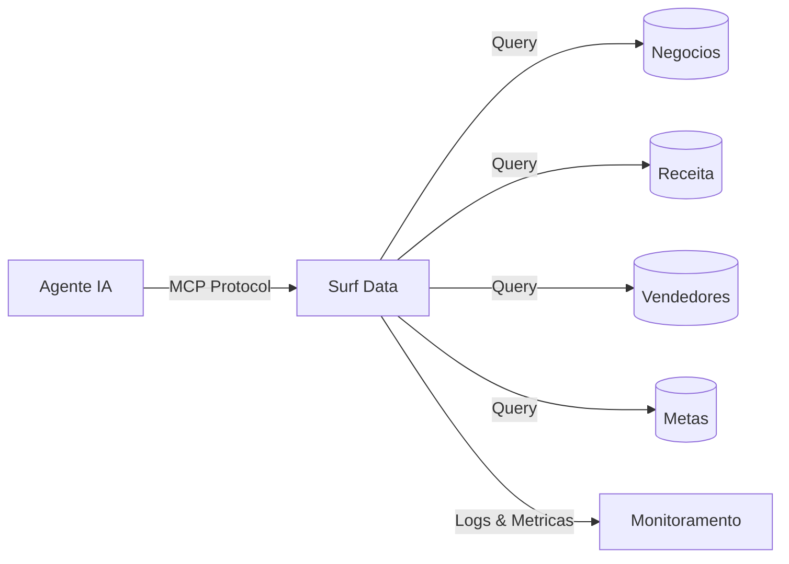

## Visao Geral

Um Agente de Analytics de Vendas alimentado pelo Surf Data da a sua equipe acesso instantaneo a metricas de receita, saude do pipeline e desempenho de vendas — tudo atraves de conversas em linguagem natural. Sem mais esperas por relatorios semanais ou construcao de dashboards customizados.

## Arquitetura



## O que voce vai construir

Ao final deste guia, seu agente de IA sera capaz de:

- Reportar receita por periodo, produto ou regiao
- Acompanhar o pipeline de vendas com estagios e probabilidades
- Comparar desempenho individual e da equipe contra metas
- Identificar tendencias e segmentos de melhor desempenho

## Passo 1: Configurar o projeto

Crie um novo projeto no Surf Data chamado **Analytics de Vendas** e conecte seu CRM ou banco de dados de vendas como datasource.

<Info>
  Se voce nao tem um banco de dados pronto, use o datasource **Demo** para acompanhar com dados de exemplo.
</Info>

## Passo 2: Criar Agent Views

### Visao Geral de Receita

```sql
SELECT
  DATE_TRUNC('month', closed_at) AS month,
  SUM(amount) AS total_revenue,
  COUNT(*) AS deals_closed,
  AVG(amount) AS avg_deal_size,
  currency
FROM deals
WHERE status = 'won'
GROUP BY month, currency
ORDER BY month DESC
```

### Snapshot do Pipeline

```sql
SELECT
  d.id AS deal_id,
  d.name AS deal_name,
  d.stage,
  d.amount,
  d.probability,
  d.expected_close_date,
  d.owner_id,
  r.name AS rep_name
FROM deals d
JOIN sales_reps r ON d.owner_id = r.id
WHERE d.status = 'open'
ORDER BY d.expected_close_date ASC
```

### Desempenho dos Vendedores

```sql
SELECT
  r.id AS rep_id,
  r.name AS rep_name,
  r.team,
  COUNT(d.id) AS total_deals,
  SUM(CASE WHEN d.status = 'won' THEN 1 ELSE 0 END) AS deals_won,
  SUM(CASE WHEN d.status = 'won' THEN d.amount ELSE 0 END) AS revenue,
  ROUND(
    SUM(CASE WHEN d.status = 'won' THEN 1 ELSE 0 END)::decimal /
    NULLIF(COUNT(d.id), 0) * 100, 1
  ) AS win_rate
FROM sales_reps r
LEFT JOIN deals d ON d.owner_id = r.id
GROUP BY r.id, r.name, r.team
```

### Metas

```sql
SELECT
  t.rep_id,
  r.name AS rep_name,
  t.period,
  t.target_amount,
  t.actual_amount,
  ROUND((t.actual_amount::decimal / NULLIF(t.target_amount, 0)) * 100, 1) AS attainment_pct
FROM targets t
JOIN sales_reps r ON t.rep_id = r.id
ORDER BY t.period DESC
```

## Passo 3: Criar MCP Tools

### `get_revenue`

- **Description**: "Obtem totais de receita por mes. Opcionalmente filtra por um periodo especifico (ex.: '2025-01' para Janeiro 2025)."
- **SQL Query**:
  ```sql
  SELECT month, total_revenue, deals_closed, avg_deal_size, currency
  FROM revenue_overview
  WHERE ({period} IS NULL OR TO_CHAR(month, 'YYYY-MM') = {period})
  ORDER BY month DESC
  LIMIT {limit}
  ```
- **Parameters**:
  - `period` (string, opcional): Mes no formato YYYY-MM
  - `limit` (string, opcional, padrao: "12"): Numero de meses a retornar

### `get_pipeline`

- **Description**: "Obtem o pipeline de vendas atual com todos os negocios abertos, seus estagios, valores e datas previstas de fechamento."
- **SQL Query**:
  ```sql
  SELECT deal_id, deal_name, stage, amount, probability, expected_close_date, rep_name
  FROM pipeline_snapshot
  WHERE ({stage} IS NULL OR stage = {stage})
  ORDER BY expected_close_date ASC
  LIMIT {limit}
  ```
- **Parameters**:
  - `stage` (string, opcional): Filtrar por estagio do negocio (ex.: "negotiation", "proposal")
  - `limit` (string, opcional, padrao: "20"): Numero de negocios a retornar

### `get_rep_performance`

- **Description**: "Obtem metricas de desempenho de vendas para um vendedor especifico ou toda a equipe. Inclui negocios ganhos, receita e taxa de conversao."
- **SQL Query**:
  ```sql
  SELECT rep_name, team, total_deals, deals_won, revenue, win_rate
  FROM sales_rep_performance
  WHERE ({rep_name} IS NULL OR rep_name ILIKE '%' || {rep_name} || '%')
  ORDER BY revenue DESC
  ```
- **Parameters**:
  - `rep_name` (string, opcional): Filtrar por nome do vendedor

### `get_target_attainment`

- **Description**: "Verifica o atingimento de metas dos vendedores. Mostra meta vs. receita real e percentual de atingimento."
- **SQL Query**:
  ```sql
  SELECT rep_name, period, target_amount, actual_amount, attainment_pct
  FROM targets
  WHERE ({rep_name} IS NULL OR rep_name ILIKE '%' || {rep_name} || '%')
    AND ({period} IS NULL OR period = {period})
  ORDER BY period DESC, attainment_pct DESC
  ```
- **Parameters**:
  - `rep_name` (string, opcional): Filtrar por nome do vendedor
  - `period` (string, opcional): Filtrar por periodo (ex.: "2025-Q1")

## Passo 4: Publicar e conectar

1. Clique em **Publish** e selecione todas as quatro tools
2. Gere um token de acesso chamado `sales-analytics`
3. Conecte seu agente de IA:

<Tabs>
  <Tab title="Claude Desktop">
    ```json
    {
      "mcpServers": {
        "sales-analytics": {
          "url": "https://surfdata.com.br/mcp/http",
          "headers": {
            "Authorization": "Bearer sk_live_<your-token>"
          }
        }
      }
    }
    ```
  </Tab>
  <Tab title="Cursor">
    ```json
    {
      "mcpServers": {
        "sales-analytics": {
          "url": "https://surfdata.com.br/mcp/http",
          "headers": {
            "Authorization": "Bearer sk_live_<your-token>"
          }
        }
      }
    }
    ```
  </Tab>
</Tabs>

## Exemplos de interacoes

<AccordionGroup>
  <Accordion title="Verificacao de receita mensal">
    **Gerente**: "Qual foi nossa receita no mes passado?"

    O agente ira:
    1. Chamar `get_revenue` com o periodo do mes atual
    2. Retornar receita total, numero de negocios fechados e ticket medio
  </Accordion>

  <Accordion title="Revisao do pipeline">
    **Gerente**: "Mostre todos os negocios em fase de negociacao"

    O agente ira:
    1. Chamar `get_pipeline` com stage "negotiation"
    2. Listar todos os negocios abertos com valores, probabilidades e datas previstas
    3. Resumir o valor total do pipeline nesse estagio
  </Accordion>

  <Accordion title="Comparacao de desempenho">
    **VP de Vendas**: "Como a equipe esta performando neste trimestre? Quem e nosso melhor closer?"

    O agente ira:
    1. Chamar `get_rep_performance` para todos os vendedores
    2. Chamar `get_target_attainment` para o trimestre atual
    3. Ranquear vendedores por receita e destacar o melhor
  </Accordion>

  <Accordion title="Previsao de negocios">
    **Gerente**: "Quais negocios devem fechar este mes?"

    O agente ira:
    1. Chamar `get_pipeline` para todos os negocios abertos
    2. Filtrar por data prevista de fechamento dentro do mes atual
    3. Calcular valor ponderado do pipeline usando probabilidades
  </Accordion>
</AccordionGroup>

## Proximos passos

<CardGroup cols={2}>
  <Card title="Monitoramento" icon="chart-line" href="/pt-br/monitoring/evals">
    Acompanhe quais consultas de analytics sao mais usadas.
  </Card>
  <Card title="Tokens" icon="key" href="/pt-br/security/tokens">
    Crie tokens separados para diferentes membros da equipe.
  </Card>
</CardGroup>
