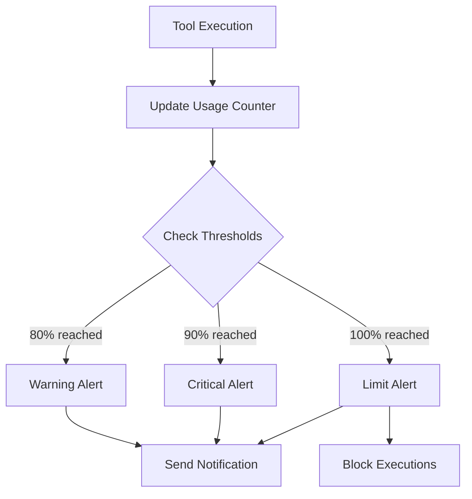

## Visão geral

O sistema de alertas do Surf Data notifica você quando o uso da sua organização se aproxima ou excede os limites definidos. Isso ajuda a evitar interrupções inesperadas de serviço e planejar a capacidade com antecedência.

## Tipos de alerta

### Alertas de execução

| Tipo de alerta | Limite | Descrição |
|----------------|--------|-----------|
| **Aviso** | 80% | Você usou 80% do seu limite mensal de execuções |
| **Crítico** | 90% | Você usou 90% — considere fazer upgrade |
| **Limite atingido** | 100% | Limite mensal atingido — execuções estão bloqueadas |

### Alertas de recursos

| Tipo de alerta | Gatilho | Descrição |
|----------------|---------|-----------|
| **Limite de usuários** | Máximo de membros atingido | Não é possível convidar novos membros |
| **Limite de datasources** | Máximo de datasources atingido | Não é possível adicionar novos datasources |

## Como os alertas funcionam

Os alertas são verificados após cada execução de tool. Cada tipo de alerta é enviado **uma vez por período de faturamento** — você não receberá notificações repetidas para o mesmo limite.

## Preferências de notificação

Configure quais notificações você recebe em **Settings** → **Profile**.

| Notificação | Padrão | Descrição |
|-------------|--------|-----------|
| **Aviso de uso** | Ativado | Alertas ao se aproximar dos limites de execução |
| **Limite atingido** | Ativado | Alerta quando o limite de execução é atingido |
| **Resumo semanal** | Ativado | Resumo semanal de uso e métricas |
| **E-mails do sistema** | Ativado | Atualizações importantes da plataforma e manutenções |
| **Newsletter** | Ativado | Novidades do produto e anúncios de funcionalidades |

<Tip>
  Recomendamos manter as notificações de **Aviso de uso** e **Limite atingido** ativadas para evitar interrupções inesperadas de serviço.
</Tip>

## Entrega de notificações

Os alertas são entregues por **e-mail** usando o endereço associado à sua conta. As notificações por e-mail incluem:

- O tipo de alerta e o limite
- Números de uso atual
- O limite do seu plano
- Um link para o Painel de Consumo
- Opções de upgrade (se aplicável)

## Respondendo aos alertas

### Quando você recebe um aviso (80%)

- Revise seu uso no [Painel de Consumo](/pt-br/monitoring/consumption)
- Identifique se o uso é esperado ou anômalo
- Considere fazer upgrade se você está consistentemente se aproximando do limite

### Quando você recebe um alerta crítico (90%)

- Tome ações imediatas para gerenciar as execuções restantes
- Avalie quais agentes/tools estão consumindo mais
- Planeje fazer upgrade antes que o limite seja atingido

### Quando o limite é atingido (100%)

- As execuções de tools ficam **bloqueadas** pelo restante do ciclo de faturamento
- Os agentes receberão um erro `LIMIT_REACHED`
- Opções:
  1. **Faça upgrade do seu plano** para aumentar o limite imediatamente
  2. **Aguarde** o próximo ciclo de faturamento para resetar o contador
  3. **Otimize** o uso dos seus tools para reduzir a contagem de execuções

## Reset do ciclo de faturamento

Os contadores de execução são resetados no início de cada período de faturamento:

- **Início do período** — primeiro dia do ciclo de faturamento
- **Fim do período** — último dia do ciclo de faturamento
- **Snapshot do limite** — o limite de execuções do plano é registrado no início do período

<Note>
  Se você fizer upgrade no meio do ciclo, o novo limite entra em vigor imediatamente. O downgrade entra em vigor no início do próximo período de faturamento.
</Note>
