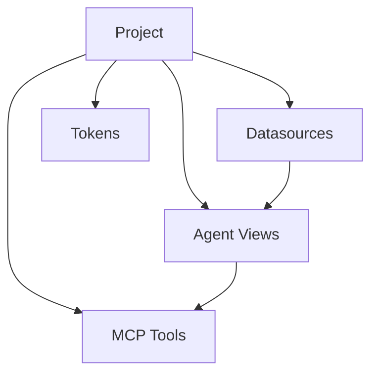

## Visão Geral

Um **Projeto** é o workspace principal no Surf Data. Ele agrupa datasources, Agent Views e MCP Tools em uma única unidade implantável. Cada projeto pode ser publicado independentemente para expor suas tools via MCP.

## Criando um projeto

1. Navegue até o **Dashboard**
2. Clique em **New Project**
3. Insira um **nome** e uma **descrição** opcional
4. Clique em **Create**

<Tip>
  Use nomes descritivos que reflitam o caso de uso: "Agente de Suporte ao Cliente", "Bot de Analytics de Vendas", "Assistente Interno de RH".
</Tip>

## Estrutura do projeto

Cada projeto contém:

| Componente | Descrição |
|-----------|-------------|
| **Datasources** | Conexões com bancos de dados (PostgreSQL, MySQL, Demo) |
| **Agent Views** | Consultas SQL salvas que definem os dados disponíveis |
| **MCP Tools** | Funções parametrizadas expostas para agentes de IA |
| **Tokens** | Bearer tokens para autenticação MCP |

## Gerenciando projetos

### Visualizando projetos

O Dashboard exibe todos os projetos da sua organização como cards. Cada card mostra:

- Nome e descrição do projeto
- Número de datasources, views e tools
- Status de publicação
- Data de criação

### Editando um projeto

Clique em um card de projeto para abrir o editor de projeto. O editor possui três painéis:

- **Barra lateral esquerda** — navegue entre datasources, views e tools
- **Área central** — edite consultas, configuração de tools e parâmetros
- **Barra lateral direita** — teste tools e visualize resultados

### Excluindo um projeto

<Warning>
  Excluir um projeto remove permanentemente todas as suas datasources, views, tools e tokens. Esta ação não pode ser desfeita.
</Warning>

## Publicação

Os projetos devem ser **publicados** antes que os agentes possam acessar suas tools. Consulte [Publicação](/pt-br/platform/publishing) para mais detalhes.

## Limites do plano

O número de projetos que você pode criar é ilimitado em todos os planos. No entanto, outros limites se aplicam:

| Recurso | Starter | Team | Growth | Enterprise |
|----------|---------|------|--------|------------|
| Datasources por projeto | 1 | 3 | 5 | Ilimitado |
| Execuções mensais (toda a org) | 5.000 | 10.000 | 25.000 | Ilimitado |
| Membros da equipe | 3 | 5 | Ilimitado | Ilimitado |
