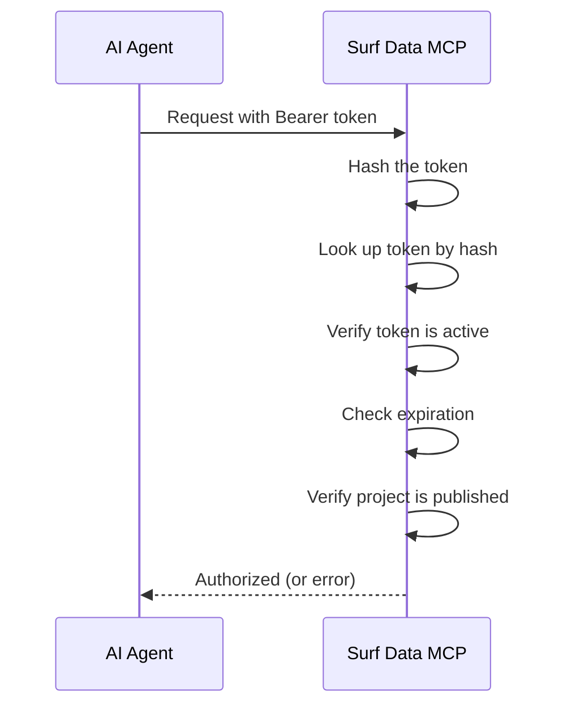

## Visão geral

O Surf Data utiliza duas camadas de autenticação:

1. **Autenticação de usuários** — powered by [Clerk](https://clerk.com) para o painel web
2. **Autenticação de agentes** — Bearer tokens para acesso ao endpoint MCP

## Autenticação de usuários

### Cadastro e login

As contas de usuários são gerenciadas pelo Clerk, que oferece:

- Autenticação por email/senha
- Provedores de login social
- SSO/SAML (plano Enterprise)
- Autenticação multifator

### Gerenciamento de sessão

Após o login, o Clerk gerencia sua sessão automaticamente:
- As sessões são seguras e criptografadas
- Renovação automática de tokens
- Sincronização de sessão entre abas

### SSO callback

Para organizações que utilizam SSO, o Surf Data suporta single sign-on baseado em SAML através da rota `/sso-callback`. Este recurso está disponível no plano **Enterprise**.

## Autenticação de agentes

Agentes de IA se autenticam no endpoint MCP usando **Bearer tokens**.

### Como funciona



### Formato do token

Os tokens seguem o formato:
```
sk_live_<your-token>
```

O prefixo `sk_live_` identifica o token como sendo do Surf Data. O restante é uma string criptograficamente aleatória.

### Armazenamento do token

Por segurança:
- Apenas o **hash** do token é armazenado no banco de dados
- O token em texto plano é exibido **uma única vez** no momento da criação
- Os primeiros 8 caracteres são armazenados como prefixo para identificação
- Os tokens não podem ser recuperados após a criação — apenas regenerados

### Validação do token

Em cada requisição, o endpoint MCP:

1. Extrai o Bearer token do header `Authorization`
2. Calcula o hash do token
3. Busca o token no banco de dados
4. Verifica se o token está **ativo** (`isActive = true`)
5. Verifica se o token não **expirou** (`expiresAt` check)
6. Confirma que o projeto vinculado está **publicado** (`isPublished = true`)

Se qualquer verificação falhar, a requisição é rejeitada com uma mensagem de erro apropriada.

## Autenticação da API

A API REST utiliza tokens de sessão do Clerk para autenticação. Todas as requisições à API são autenticadas usando o cookie de sessão definido durante o login.

Os endpoints da API verificam:
- Sessão válida do Clerk
- Participação do usuário na organização de destino
- Permissões de papel apropriadas (Admin vs Member)

## Boas práticas de segurança

<AccordionGroup>
  <Accordion title="Use tokens separados por agente">
    Crie um token único para cada agente ou integração. Isso permite revogar tokens individuais sem afetar os demais.
  </Accordion>

  <Accordion title="Defina datas de expiração nos tokens">
    Para uso em produção, defina datas de expiração nos tokens e faça a rotação regularmente. Isso limita a janela de exposição caso um token seja comprometido.
  </Accordion>

  <Accordion title="Use usuários de banco de dados somente leitura">
    Configure suas conexões de datasource com credenciais de banco de dados somente leitura. Isso fornece defesa em profundidade além das verificações de segurança de queries do Surf Data.
  </Accordion>

  <Accordion title="Monitore o uso dos tokens">
    Use o [Painel de Consumo](/pt-br/monitoring/consumption) para rastrear quais tokens estão sendo usados e com que frequência. Padrões incomuns podem indicar acesso não autorizado.
  </Accordion>
</AccordionGroup>
