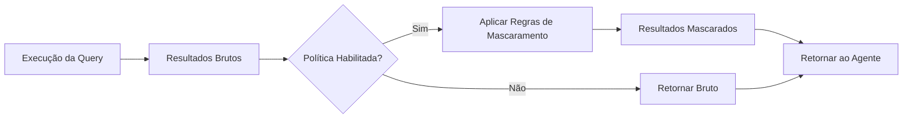

## Visão geral

O Surf Data oferece **regras integradas de mascaramento de PII** que transformam automaticamente dados sensíveis antes que eles cheguem aos agentes de IA. Isso garante que informações de identificação pessoal (PII) sejam protegidas mesmo quando os agentes precisam consultar bancos de dados de produção.

O sistema inclui **19 tipos predefinidos de mascaramento** otimizados para formatos brasileiros (CPF, CNPJ, RG) além de tipos universais (email, telefone, nome, etc.), e pode **detectar colunas de PII automaticamente** analisando os nomes das colunas.

## Como funciona

O mascaramento de dados é aplicado no **nível da ferramenta**. Quando habilitado, as regras de mascaramento são aplicadas nos resultados da query antes que sejam retornados ao agente.



As regras de mascaramento são armazenadas como um array JSON no campo `policyCode` da ferramenta:

```json
[
  { "column": "email", "type": "email" },
  { "column": "cpf", "type": "cpf" },
  { "column": "nome_completo", "type": "name" },
  { "column": "telefone", "type": "phone" }
]
```

Cada regra mapeia um **nome de coluna** para um **tipo de mascaramento**. Quando os resultados são retornados, o sistema aplica a função de mascaramento correspondente a cada valor naquela coluna.

## Habilitando o mascaramento de dados

<Steps>
  <Step title="Abra o editor de ferramentas">
    Navegue até seu projeto e selecione o MCP Tool que você deseja proteger.
  </Step>
  <Step title="Detectar PII automaticamente (recomendado)">
    Clique no botão **Detect PII**. O sistema executa a query da ferramenta com `LIMIT 1` e analisa os nomes das colunas para sugerir regras de mascaramento automaticamente. Ele reconhece nomes de colunas em português e inglês (ex.: `email`, `telefone`, `cpf`, `nome_completo`, `endereco`).
  </Step>
  <Step title="Revise e personalize as regras">
    Revise as regras sugeridas. Você pode adicionar, remover ou alterar o tipo de mascaramento para cada coluna.
  </Step>
  <Step title="Habilite a política">
    Ative o interruptor **Policy Enabled** na configuração da ferramenta.
  </Step>
  <Step title="Teste">
    Execute a ferramenta com valores de teste para verificar se o mascaramento funciona conforme esperado. Os resultados do teste mostrarão `masked: true` quando o mascaramento é aplicado.
  </Step>
</Steps>

## Tipos predefinidos de mascaramento

| Tipo | Descrição | Exemplo (antes → depois) |
|------|-----------|-------------------------|
| `cpf` | CPF brasileiro | `123.456.789-00` → `***.***.*89-00` |
| `cnpj` | CNPJ brasileiro | `12.345.678/0001-00` → `**.***.678/****-00` |
| `rg` | RG brasileiro | `12.345.678-9` → `**.***.678-*` |
| `email` | Endereço de email | `john@example.com` → `j***@e*****.com` |
| `phone` | Número de telefone | `(11) 98765-1234` → `(11) *****-1234` |
| `name` | Nome de pessoa | `João Silva` → `J*** S****` |
| `address` | Endereço físico | `Rua das Flores, 123` → `[REDACTED]` |
| `ip` | Endereço IP | `192.168.1.100` → `192.168.*.*` |
| `credit_card` | Número de cartão de crédito | `4111-1111-1111-1111` → `****-****-****-1111` |
| `birth_date` | Data de nascimento | `1990-05-15` → `****-**-15` |
| `salary` | Salário/renda | `R$ 5.000,00` → `[REDACTED]` |
| `health_data` | Informações de saúde | Qualquer valor → `[REDACTED]` |
| `biometric` | Dados biométricos | Qualquer valor → `[REDACTED]` |
| `genetic` | Dados genéticos | Qualquer valor → `[REDACTED]` |
| `political_opinion` | Opinião política | Qualquer valor → `[REDACTED]` |
| `religious_belief` | Crença religiosa | Qualquer valor → `[REDACTED]` |
| `sexual_orientation` | Orientação sexual | Qualquer valor → `[REDACTED]` |
| `ethnic_origin` | Origem étnica | Qualquer valor → `[REDACTED]` |
| `generic` | Mascaramento genérico | Qualquer valor → `[MASKED]` |

## Padrões de detecção automática

A detecção automática reconhece colunas por padrões de nome em português e inglês:

| Tipo de PII | Nomes de colunas detectados |
|-------------|----------------------------|
| CPF | `cpf`, `nr_cpf`, `num_cpf`, `cpf_cliente` |
| CNPJ | `cnpj`, `nr_cnpj`, `num_cnpj` |
| RG | `rg`, `nr_rg`, `num_rg` |
| Email | `email`, `e_mail`, `email_address`, `endereco_email` |
| Telefone | `telefone`, `celular`, `phone`, `mobile`, `fone` |
| Nome | `nome`, `nome_completo`, `full_name`, `first_name`, `sobrenome` |
| Endereço | `endereco`, `address`, `logradouro`, `cep`, `zip_code` |
| IP | `ip`, `ip_address`, `endereco_ip` |
| Cartão de crédito | `cartao`, `credit_card`, `card_number`, `numero_cartao` |
| Data de nascimento | `nascimento`, `data_nascimento`, `birth_date`, `date_of_birth` |
| Salário | `salario`, `salary`, `remuneracao`, `renda` |

## Boas práticas

<AccordionGroup>
  <Accordion title="Use a detecção automática de PII para novas ferramentas">
    Sempre comece com a detecção automática ao criar uma nova ferramenta. Ela reconhece padrões comuns de nomes de colunas e sugere os tipos de mascaramento apropriados. Depois, você pode ajustar as regras.
  </Accordion>

  <Accordion title="Mascare no nível da ferramenta, não da view">
    Aplique mascaramento nas ferramentas que os agentes podem acessar, não em views internas usadas para consultas do painel. Isso mantém suas análises internas precisas enquanto protege os dados expostos aos agentes.
  </Accordion>

  <Accordion title="Teste o mascaramento minuciosamente">
    Sempre teste suas regras de mascaramento com dados reais. O endpoint de teste retorna um flag `masked: true` quando o mascaramento é aplicado. Verifique que:
    - Todas as colunas com PII estão corretamente mascaradas
    - Colunas sem PII permanecem legíveis
    - Valores nulos são tratados corretamente
  </Accordion>

  <Accordion title="Use tipos REDACTED para categorias sensíveis da LGPD">
    Para categorias de dados sensíveis da LGPD (saúde, biométricos, genéticos, político, religioso, orientação sexual, origem étnica), use os tipos de mascaramento correspondentes que redatam completamente os valores em vez de mascaramento parcial.
  </Accordion>

  <Accordion title="Combine com exclusão de colunas">
    Para dados altamente sensíveis (senhas, chaves de API, detalhes financeiros), exclua as colunas inteiramente das suas Agent Views em vez de depender apenas do mascaramento.
  </Accordion>
</AccordionGroup>

## Mascaramento e conformidade com a LGPD

O mascaramento de dados é um componente essencial da conformidade com a LGPD. Ao mascarar PII antes que chegue aos agentes de IA, você:

- **Minimiza a exposição de dados** — os agentes veem apenas o necessário
- **Atende aos requisitos de consentimento** — os dados processados não identificam indivíduos
- **Reduz o impacto de violações** — mesmo que o contexto de um agente vaze, o PII está protegido
- **Demonstra conformidade** — os logs de auditoria mostram que o mascaramento foi aplicado

Os tipos predefinidos do sistema cobrem todas as categorias de dados sensíveis da LGPD (Artigo 5º, II), incluindo dados de saúde, dados biométricos e genéticos, opinião política, crença religiosa, orientação sexual e origem étnica.

Consulte [Conformidade com a LGPD](/pt-br/security/lgpd) para mais detalhes sobre como o Surf Data ajuda você a atender aos requisitos regulatórios.
