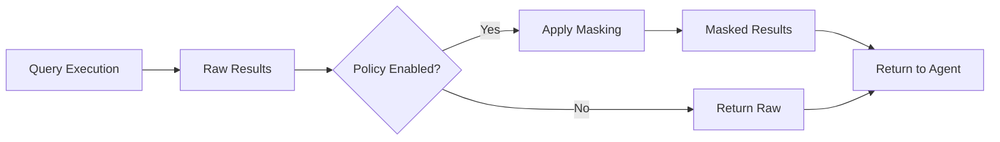

## Visão geral

O Surf Data oferece **políticas de mascaramento de dados** que transformam automaticamente dados sensíveis antes que eles cheguem aos agentes de IA. Isso garante que informações de identificação pessoal (PII) sejam protegidas mesmo quando os agentes precisam consultar bancos de dados de produção.

## Como funciona

O mascaramento de dados é aplicado no **nível da ferramenta**. Quando habilitado, uma função de política é executada nos resultados da query antes que sejam retornados ao agente.



## Habilitando o mascaramento de dados

<Steps>
  <Step title="Abra o editor de ferramentas">
    Navegue até seu projeto e selecione o MCP Tool que você deseja proteger.
  </Step>
  <Step title="Habilite a política">
    Ative o interruptor **Policy Enabled** na configuração da ferramenta.
  </Step>
  <Step title="Escreva o código da política">
    Defina suas regras de mascaramento no editor de políticas. As políticas são funções JavaScript que transformam as linhas de resultado.
  </Step>
  <Step title="Teste">
    Execute a ferramenta com valores de teste para verificar se o mascaramento funciona conforme esperado.
  </Step>
</Steps>

## Padrões comuns de mascaramento

### Mascaramento de email

Transforme endereços de email para ocultar a parte local:

```javascript
// john.doe@example.com → j***@example.com
function maskEmail(email) {
  const [local, domain] = email.split('@');
  return local[0] + '***@' + domain;
}
```

### Mascaramento de telefone

Oculte a maioria dos dígitos de números de telefone:

```javascript
// +55 11 98765-4321 → +55 11 ****-4321
function maskPhone(phone) {
  return phone.replace(/(\d{4,})-?(\d{4})$/, '****-$2');
}
```

### Mascaramento de CPF

Mascare números de CPF:

```javascript
// 123.456.789-00 → ***.***.789-00
function maskCPF(cpf) {
  return cpf.replace(/^\d{3}\.\d{3}/, '***. ***');
}
```

### Mascaramento parcial de nome

Exiba apenas o primeiro nome:

```javascript
// "João da Silva" → "João S."
function maskName(name) {
  const parts = name.split(' ');
  if (parts.length <= 1) return name;
  return parts[0] + ' ' + parts[parts.length - 1][0] + '.';
}
```

## Boas práticas

<AccordionGroup>
  <Accordion title="Identifique colunas com PII">
    Antes de criar ferramentas, audite seus dados em busca de PII. Campos comuns incluem:
    - Endereços de email
    - Números de telefone
    - Números de CPF/CNPJ
    - Nomes completos
    - Endereços físicos
    - Endereços IP
    - Data de nascimento
  </Accordion>

  <Accordion title="Mascare no nível da ferramenta, não da view">
    Aplique mascaramento nas ferramentas que os agentes podem acessar, não em views internas usadas para consultas do painel. Isso mantém suas análises internas precisas enquanto protege os dados expostos aos agentes.
  </Accordion>

  <Accordion title="Teste o mascaramento minuciosamente">
    Sempre teste suas políticas de mascaramento com padrões de dados reais. Casos extremos a verificar:
    - Valores nulos ou vazios
    - Formatos inesperados
    - Caracteres Unicode
    - Strings muito longas
  </Accordion>

  <Accordion title="Combine com exclusão de colunas">
    Para dados altamente sensíveis (senhas, chaves de API, detalhes financeiros), exclua as colunas inteiramente das suas Agent Views em vez de depender apenas do mascaramento.
  </Accordion>
</AccordionGroup>

## Mascaramento e conformidade com a LGPD

O mascaramento de dados é um componente essencial da conformidade com a LGPD. Ao mascarar PII antes que chegue aos agentes de IA, você:

- **Minimiza a exposição de dados** — os agentes veem apenas o necessário
- **Atende aos requisitos de consentimento** — os dados processados não identificam indivíduos
- **Reduz o impacto de violações** — mesmo que o contexto de um agente vaze, o PII está protegido
- **Demonstra conformidade** — os logs de auditoria mostram que o mascaramento foi aplicado

Consulte [Conformidade com a LGPD](/pt-br/security/lgpd) para mais detalhes sobre como o Surf Data ajuda você a atender aos requisitos regulatórios.
