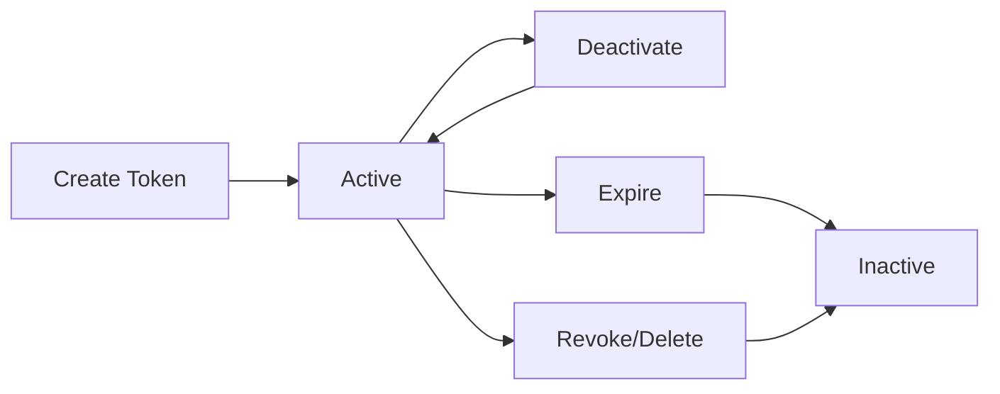

## Visão geral

**MCP Tokens** são Bearer tokens que autenticam requisições de agentes de IA aos seus projetos publicados. Os tokens são vinculados ao projeto e fornecem acesso seguro e revogável às suas ferramentas MCP.

## Ciclo de vida do token



## Criando tokens

Os tokens são criados durante o [fluxo de publicação](/pt-br/platform/publishing) ou nas configurações do projeto:

1. Navegue até seu projeto
2. Abra a seção **Tokens**
3. Clique em **Generate Token**
4. Insira um **nome** (ex.: "claude-production", "cursor-dev")
5. Opcionalmente, defina uma **data de expiração**
6. Clique em **Generate**

<Warning>
  O token completo é exibido **apenas uma vez** no momento da criação. Copie-o imediatamente e armazene em um local seguro (variável de ambiente, gerenciador de segredos, etc.).
</Warning>

### Formato do token

```
sk_live_<your-token>
```

- **Prefixo**: `sk_live_` — identifica o tipo do token
- **Corpo**: String criptograficamente aleatória
- **Armazenamento**: Apenas o hash é armazenado; o prefixo é armazenado para exibição

## Gerenciando tokens

### Visualizando tokens

A lista de tokens exibe:

| Campo | Descrição |
|-------|-------------|
| Nome | Identificador legível por humanos |
| Prefixo | Primeiros 8 caracteres para identificação |
| Status | Ativo ou inativo |
| Criado em | Quando o token foi gerado |
| Último uso | Autenticação bem-sucedida mais recente |
| Expira em | Data de expiração (se definida) |

### Ativando / desativando

Alterne o status de um token sem excluí-lo:

- **Desativar** — desabilita temporariamente o token; os agentes receberão erros de autenticação
- **Ativar** — reabilita um token previamente desativado

Isso é útil para janelas de manutenção ou depuração.

### Revogando tokens

**Revogar** exclui permanentemente um token. Esta ação não pode ser desfeita. Use quando:

- Um token foi comprometido
- Uma integração não é mais necessária
- Você está fazendo rotação de tokens

## Segurança de tokens

### Boas práticas de armazenamento

<AccordionGroup>
  <Accordion title="Use variáveis de ambiente">
    Nunca codifique tokens diretamente no código-fonte. Use variáveis de ambiente:

    ```bash
    export SURF_DATA_TOKEN="sk_live_xxxxxxxx..."
    ```
  </Accordion>

  <Accordion title="Use gerenciadores de segredos">
    Para ambientes de produção, use um gerenciador de segredos:
    - AWS Secrets Manager
    - Google Secret Manager
    - HashiCorp Vault
    - Azure Key Vault
  </Accordion>

  <Accordion title="Faça rotação de tokens regularmente">
    Crie novos tokens e revogue os antigos em um cronograma regular. O período de rotação recomendado é de 90 dias.
  </Accordion>

  <Accordion title="Use tokens separados por ambiente">
    Crie tokens distintos para desenvolvimento, staging e produção. Isso permite revogar um token de desenvolvimento comprometido sem afetar a produção.
  </Accordion>
</AccordionGroup>

### O que fazer quando um token é comprometido?

1. **Revogue imediatamente** o token comprometido pelo painel
2. **Gere um novo token** e atualize a configuração do seu agente
3. **Revise os logs de auditoria** para verificar acessos não autorizados
4. **Configure alertas** caso ainda não tenha feito

## Fluxo de validação do token

Quando um agente faz uma requisição, as seguintes verificações ocorrem:

1. **Verificação de formato** — o token deve começar com `sk_live_`
2. **Busca por hash** — o hash do token deve existir no banco de dados
3. **Verificação de atividade** — `isActive` deve ser `true`
4. **Verificação de expiração** — `expiresAt` deve estar no futuro (ou ser null)
5. **Verificação de projeto** — o projeto vinculado deve estar publicado

Se qualquer verificação falhar, o agente recebe um erro `401 Unauthorized` com uma mensagem descritiva.

## Gerenciamento via API

Os tokens também podem ser gerenciados programaticamente via API REST. Consulte a [Referência da API de Tokens](/pt-br/api-reference/tokens) para ver os endpoints.
