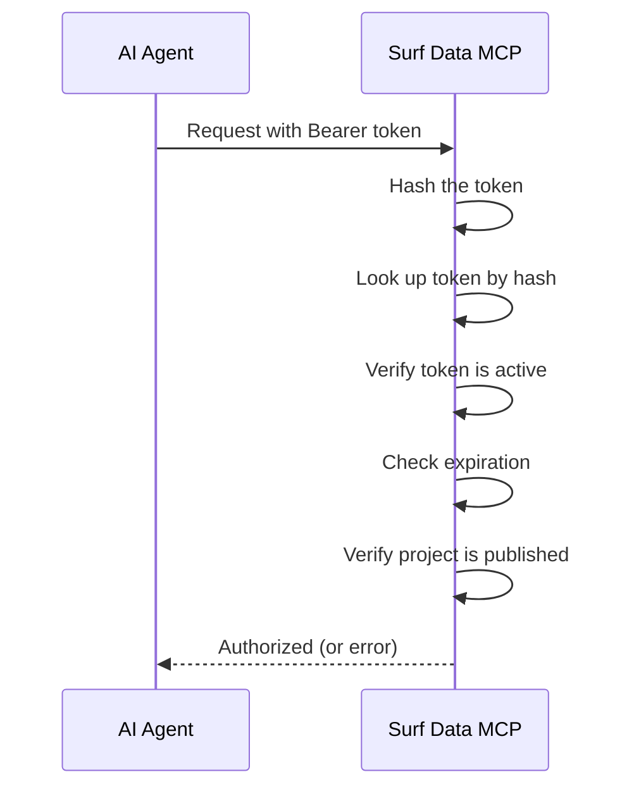

## Overview

Surf Data uses two layers of authentication:

1. **User authentication** — powered by [Clerk](https://clerk.com) for the web dashboard
2. **Agent authentication** — Bearer tokens for MCP endpoint access

## User authentication

### Sign up and sign in

User accounts are managed through Clerk, which provides:

- Email/password authentication
- Social login providers
- SSO/SAML (Enterprise plan)
- Multi-factor authentication

### Session management

After signing in, Clerk manages your session automatically:
- Sessions are secure and encrypted
- Automatic token refresh
- Cross-tab session synchronization

### SSO callback

For organizations using SSO, Surf Data supports SAML-based single sign-on through the `/sso-callback` route. This is available on the **Enterprise** plan.

## Agent authentication

AI agents authenticate to the MCP endpoint using **Bearer tokens**.

### How it works



### Token format

Tokens follow the format:
```
sk_live_<your-token>
```

The prefix `sk_live_` identifies it as a Surf Data token. The rest is a cryptographically random string.

### Token storage

For security:
- Only the **hash** of the token is stored in the database
- The plain token is shown **once** at creation time
- The first 8 characters are stored as a prefix for identification
- Tokens cannot be retrieved after creation — only regenerated

### Token validation

On every request, the MCP endpoint:

1. Extracts the Bearer token from the `Authorization` header
2. Computes the token hash
3. Looks up the token in the database
4. Verifies the token is **active** (`isActive = true`)
5. Checks the token has not **expired** (`expiresAt` check)
6. Confirms the linked project is **published** (`isPublished = true`)

If any check fails, the request is rejected with an appropriate error message.

## API authentication

The REST API uses Clerk session tokens for authentication. All API requests are authenticated using the session cookie set during sign-in.

API endpoints verify:
- Valid Clerk session
- User membership in the target organization
- Appropriate role permissions (Admin vs Member)

## Security best practices

<AccordionGroup>
  <Accordion title="Use separate tokens per agent">
    Create a unique token for each agent or integration. This lets you revoke individual tokens without affecting others.
  </Accordion>

  <Accordion title="Set token expiration dates">
    For production use, set expiration dates on tokens and rotate them regularly. This limits the window of exposure if a token is compromised.
  </Accordion>

  <Accordion title="Use read-only database users">
    Configure your datasource connections with read-only database credentials. This provides defense in depth beyond Surf Data's query safety checks.
  </Accordion>

  <Accordion title="Monitor token usage">
    Use the [Consumption Dashboard](/monitoring/consumption) to track which tokens are being used and how often. Unusual patterns may indicate unauthorized access.
  </Accordion>
</AccordionGroup>
