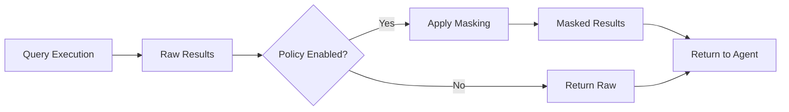

## Overview

Surf Data provides **data masking policies** that automatically transform sensitive data before it reaches AI agents. This ensures personally identifiable information (PII) is protected even when agents need to query production databases.

## How it works

Data masking is applied at the **tool level**. When enabled, a policy function runs on query results before they are returned to the agent.



## Enabling data masking

<Steps>
  <Step title="Open the tool editor">
    Navigate to your project and select the MCP Tool you want to protect.
  </Step>
  <Step title="Enable policy">
    Toggle the **Policy Enabled** switch in the tool configuration.
  </Step>
  <Step title="Write policy code">
    Define your masking rules in the policy editor. Policies are JavaScript functions that transform result rows.
  </Step>
  <Step title="Test">
    Run the tool with test values to verify the masking works as expected.
  </Step>
</Steps>

## Common masking patterns

### Email masking

Transform email addresses to hide the local part:

```javascript
// john.doe@example.com → j***@example.com
function maskEmail(email) {
  const [local, domain] = email.split('@');
  return local[0] + '***@' + domain;
}
```

### Phone number masking

Hide most digits of phone numbers:

```javascript
// +55 11 98765-4321 → +55 11 ****-4321
function maskPhone(phone) {
  return phone.replace(/(\d{4,})-?(\d{4})$/, '****-$2');
}
```

### CPF masking

Mask Brazilian CPF numbers:

```javascript
// 123.456.789-00 → ***.***.789-00
function maskCPF(cpf) {
  return cpf.replace(/^\d{3}\.\d{3}/, '***. ***');
}
```

### Partial name masking

Show only the first name:

```javascript
// "João da Silva" → "João S."
function maskName(name) {
  const parts = name.split(' ');
  if (parts.length <= 1) return name;
  return parts[0] + ' ' + parts[parts.length - 1][0] + '.';
}
```

## Best practices

<AccordionGroup>
  <Accordion title="Identify PII columns">
    Before creating tools, audit your data for PII. Common fields include:
    - Email addresses
    - Phone numbers
    - CPF/CNPJ numbers
    - Full names
    - Physical addresses
    - IP addresses
    - Date of birth
  </Accordion>

  <Accordion title="Mask at the tool level, not the view level">
    Apply masking on tools that agents can access, not on internal views used for dashboard queries. This keeps your internal analytics accurate while protecting agent-facing data.
  </Accordion>

  <Accordion title="Test masking thoroughly">
    Always test your masking policies with real-world data patterns. Edge cases to check:
    - Null or empty values
    - Unexpected formats
    - Unicode characters
    - Very long strings
  </Accordion>

  <Accordion title="Combine with column exclusion">
    For highly sensitive data (passwords, API keys, financial details), exclude the columns entirely from your Agent Views rather than relying on masking alone.
  </Accordion>
</AccordionGroup>

## Masking and LGPD compliance

Data masking is a key component of LGPD compliance. By masking PII before it reaches AI agents, you:

- **Minimize data exposure** — agents only see what they need
- **Meet consent requirements** — processed data doesn't identify individuals
- **Reduce breach impact** — even if an agent's context is leaked, PII is protected
- **Demonstrate compliance** — audit logs show masking was applied

See [LGPD Compliance](/security/lgpd) for more details on how Surf Data helps you meet regulatory requirements.
