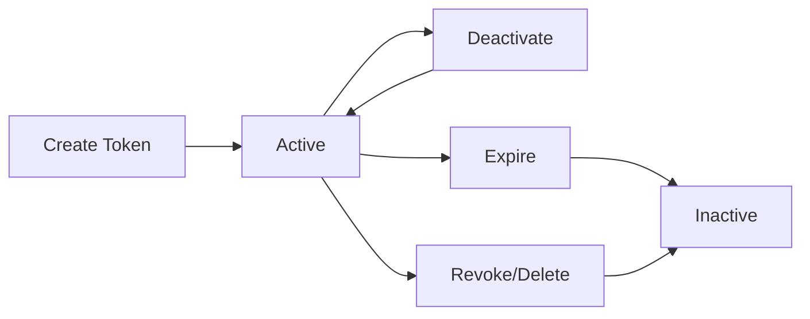

## Overview

**MCP Tokens** are Bearer tokens that authenticate AI agent requests to your published projects. Tokens are project-scoped and provide secure, revocable access to your MCP tools.

## Token lifecycle



## Creating tokens

Tokens are created during the [publishing workflow](/platform/publishing) or from the project settings:

1. Navigate to your project
2. Open the **Tokens** section
3. Click **Generate Token**
4. Enter a **name** (e.g., "claude-production", "cursor-dev")
5. Optionally set an **expiration date**
6. Click **Generate**

<Warning>
  The full token is shown **only once** at creation. Copy it immediately and store it in a secure location (environment variable, secret manager, etc.).
</Warning>

### Token format

```
sk_live_<your-token>
```

- **Prefix**: `sk_live_` — identifies the token type
- **Body**: Cryptographically random string
- **Storage**: Only the hash is stored; the prefix is stored for display

## Managing tokens

### Viewing tokens

The tokens list shows:

| Field | Description |
|-------|-------------|
| Name | Human-readable identifier |
| Prefix | First 8 characters for identification |
| Status | Active or inactive |
| Created | When the token was generated |
| Last used | Most recent successful authentication |
| Expires | Expiration date (if set) |

### Activating / deactivating

Toggle a token's status without deleting it:

- **Deactivate** — temporarily disables the token; agents will receive authentication errors
- **Activate** — re-enables a previously deactivated token

This is useful for maintenance windows or debugging.

### Revoking tokens

**Revoke** permanently deletes a token. This action cannot be undone. Use this when:

- A token has been compromised
- An integration is no longer needed
- You're rotating tokens

## Token security

### Storage best practices

<AccordionGroup>
  <Accordion title="Use environment variables">
    Never hardcode tokens in source code. Use environment variables:

    ```bash
    export SURF_DATA_TOKEN="sk_live_xxxxxxxx..."
    ```
  </Accordion>

  <Accordion title="Use secret managers">
    For production environments, use a secret manager:
    - AWS Secrets Manager
    - Google Secret Manager
    - HashiCorp Vault
    - Azure Key Vault
  </Accordion>

  <Accordion title="Rotate tokens regularly">
    Create new tokens and revoke old ones on a regular schedule. The recommended rotation period is 90 days.
  </Accordion>

  <Accordion title="Use separate tokens per environment">
    Create distinct tokens for development, staging, and production. This lets you revoke a compromised dev token without affecting production.
  </Accordion>
</AccordionGroup>

### What happens when a token is compromised?

1. **Immediately revoke** the compromised token from the dashboard
2. **Generate a new token** and update your agent configuration
3. **Review audit logs** to check for unauthorized access
4. **Set up alerts** if you haven't already

## Token validation flow

When an agent makes a request, the following checks occur:

1. **Format check** — token must start with `sk_live_`
2. **Hash lookup** — the token hash must exist in the database
3. **Active check** — `isActive` must be `true`
4. **Expiration check** — `expiresAt` must be in the future (or null)
5. **Project check** — the linked project must be published

If any check fails, the agent receives a `401 Unauthorized` error with a descriptive message.

## API management

Tokens can also be managed programmatically via the REST API. See the [Tokens API Reference](/api-reference/tokens) for endpoints.
